SimplyKitchen is a desktop app for food inventory management, optimized for use via a Command Line Interface (CLI) while still having the benefits of a Graphical User Interface (GUI).
With intuitive and practical features, SimplyKitchen can get food management tasks done faster and more efficiently than traditional GUI apps.

SimplyKitchen aims to aid the domestic individuals who manage their kitchens at home by providing an apt food inventory management system.
We have taken into consideration the common problems our target audience may face while managing their kitchen, and have created specialized features in our application in order to address those problems.
Since it is meant for general households, care has been taken to make the app more intuitive and not overwhelming to facilitate comfortable usage for all.
We hope to make SimplyKitchen a household name in Singapore and appreciate your assistance in helping us do so!

--------------------------------------------------------------------------------------------------------------------

# Table of contents

* [About this document](#about-this-document)
* [Setting up, getting started](#setting-up-getting-started)
* [Design](#design)
  * [Architecture](#architecture)
  * [UI component](#ui-component)
  * [Logic component](#logic-component)
  * [Model component](#model-component)
  * [Storage component](#storage-component)
  * [Common classes](#common-classes)
* [Implementation](#implementation)
  * [Undo/Redo feature](#undoredo-feature)
  * [Sorting feature](#sorting-feature)
  * [Quantity Field in Food Items](#quantity-field-in-food-items)
  * [Find feature](#find-feature)
* [Documentation, logging, testing, configuration, dev-ops](#documentation-logging-testing-configuration-dev-ops)
* [Appendix: Requirements](#appendix-requirements)
  * [Product scope](#product-scope)
  * [Glossary](#glossary)
  * [User stories](#user-stories)
  * [Use cases](#use-cases)
  * [Non-Functional Requirements](#non-functional-requirements)
* [Appendix: Instructions for manual testing](#appendix-instructions-for-manual-testing)
  * [Launch and shutdown](#launch-and-shutdown)
  * [Deleting a food item](#deleting-a-food-item)
  * [Saving data](#saving-data)

--------------------------------------------------------------------------------------------------------------------

## **About this document**

This document is a Developer Guide meant to assist project developers in understanding the various aspects in the production of SimplyKitchen.

The [Setting up, getting started](#setting-up-getting-started) section of this document guides you in setting up the code base on your computer and helps you begin working on the project.

The [Design](#design) section of this document can help you understand the design of the code base as a whole and its various components.
This section contains effective UML Diagrams which can help you understand the OOP structure of the code and the execution flow of the app.

The [Implementation](#implementation) section contains details about the implementation of some of the features in SimplyKitchen.
It also provides details about design considerations and implementation alternatives.
This section allows you to understand our thought process and make your own design considerations.

This is followed by a section consisting of guides for [Documentation, Logging, Testing, Configuration and DevOps](#documentation-logging-testing-configuration-dev-ops).
Each of these guides give specific assistance in the context of the project.

The [Appendix for Requirements](#appendix-requirements) consists of the details of the planning stage of the project.
It gives an idea of the requirements of the target audience of SimplyKitchen, along with use cases of how they will use the app.
The [Glossary](#glossary) and [Non-Functional Requirements](#non-functional-requirements) provide other key information relevant to the document and the app.

This document ends with an [Appendix for Instructions for Manual Testing](#appendix-instructions-for-manual-testing).

<a href="https://ay2021s1-cs2103t-f13-4.github.io/tp/DeveloperGuide.html">^ Back to top</a>

--------------------------------------------------------------------------------------------------------------------

## **Setting up, getting started**

Refer to the guide [_Setting up and getting started_](SettingUp.md).

<a href="https://ay2021s1-cs2103t-f13-4.github.io/tp/DeveloperGuide.html">^ Back to top</a>

--------------------------------------------------------------------------------------------------------------------

## **Design**

### Architecture

The ***Architecture Diagram*** given above explains the high-level design of the App. Given below is a quick overview of each component.

:bulb: **Tip:** The `.puml` files used to create diagrams in this document can be found in the [diagrams](https://github.com/AY2021S1-CS2103T-F13-4/tp/tree/master/docs/diagrams/) folder. Refer to the [_PlantUML Tutorial_ at se-edu/guides](https://se-education.org/guides/tutorials/plantUml.html) to learn how to create and edit diagrams.

**`Main`** has two classes called [`Main`](https://github.com/AY2021S1-CS2103T-F13-4/tp/blob/master/src/main/java/seedu/simplykitchen/Main.java) and [`MainApp`](https://github.com/AY2021S1-CS2103T-F13-4/tp/blob/master/src/main/java/seedu/simplykitchen/MainApp.java). It is responsible for,
* At app launch: Initializes the components in the correct sequence, and connects them up with each other.
* At shut down: Shuts down the components and invokes cleanup methods where necessary.

[**`Commons`**](#common-classes) represents a collection of classes used by multiple other components.

The rest of the App consists of four components.

* [**`UI`**](#ui-component): The UI of the App.
* [**`Logic`**](#logic-component): The command executor.
* [**`Model`**](#model-component): Holds the data of the App in memory.
* [**`Storage`**](#storage-component): Reads data from, and writes data to, the hard disk.

Each of the four components,

* defines its *API* in an `interface` with the same name as the Component.
* exposes its functionality using a concrete `{Component Name}Manager` class (which implements the corresponding API `interface` mentioned in the previous point.

For example, the `Logic` component (see the class diagram given below) defines its API in the `Logic.java` interface and exposes its functionality using the `LogicManager.java` class which implements the `Logic` interface.

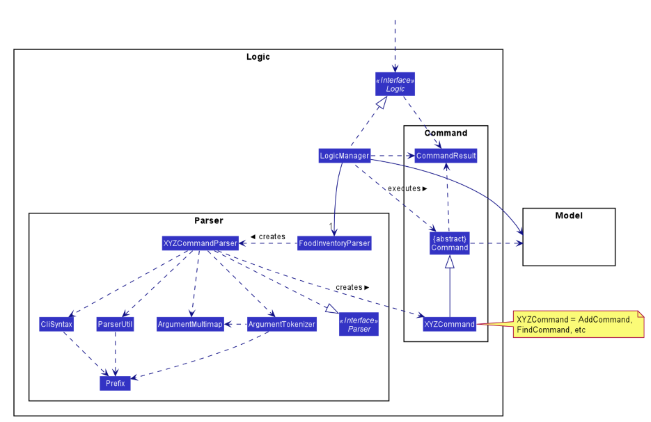

**How the architecture components interact with each other**

The *Sequence Diagram* below shows how the components interact with each other for the scenario where the user issues the command `delete 1`.

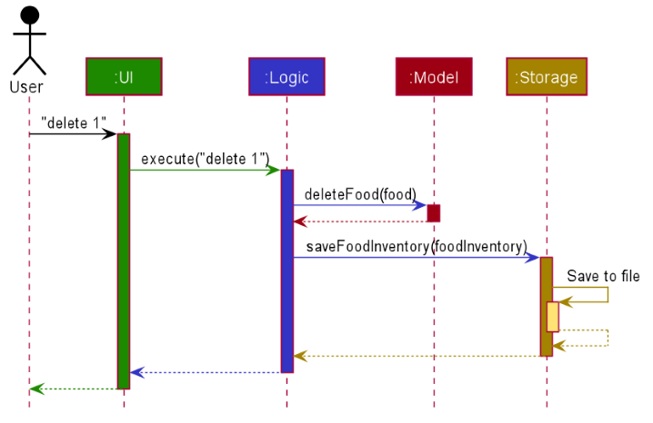

The sections below give more details of each component.

### UI component

**API** :
[`Ui.java`](https://github.com/AY2021S1-CS2103T-F13-4/tp/blob/master/src/main/java/seedu/simplykitchen/ui/Ui.java)

The UI consists of a `MainWindow` that is made up of parts e.g.`CommandBox`, `ResultDisplay`, `FoodListPanel`, `StatusBarFooter`, `ExpiringFoodListPanel`, `ExpiredFoodListPanel` etc. All these, including the `MainWindow`, inherit from the abstract `UiPart` class.

The `UI` component uses JavaFx UI framework. The layout of these UI parts are defined in matching `.fxml` files that are in the `src/main/resources/view` folder. For example, the layout of the [`MainWindow`](https://github.com/AY2021S1-CS2103T-F13-4/tp/blob/master/src/main/java/seedu/simplykitchen/ui/MainWindow.java) is specified in [`MainWindow.fxml`](https://github.com/AY2021S1-CS2103T-F13-4/tp/blob/master/src/main/resources/view/MainWindow.fxml)

The `UI` component,

* Executes user commands using the `Logic` component.
* Listens for changes to `Model` data so that the UI can be updated with the modified data.

### Logic component

**API** :
[`Logic.java`](https://github.com/AY2021S1-CS2103T-F13-4/tp/blob/master/src/main/java/seedu/simplykitchen/logic/Logic.java)

1. `Logic` uses the `FoodInventoryParser` class to parse the user command.
1. This results in a `Command` object which is executed by the `LogicManager`.
1. The command execution can affect the `Model` (e.g. adding a food item).
1. The result of the command execution is encapsulated as a `CommandResult` object which is passed back to the `Ui`.
1. In addition, the `CommandResult` object can also instruct the `Ui` to perform certain actions, such as displaying help to the user.

Given below is the Sequence Diagram for interactions within the `Logic` component for the `execute("delete 1")` API call.

:information_source: **Note:** The lifeline for `DeleteCommandParser` should end at the destroy marker (X) but due to a limitation of PlantUML, the lifeline reaches the end of diagram.

### Model component

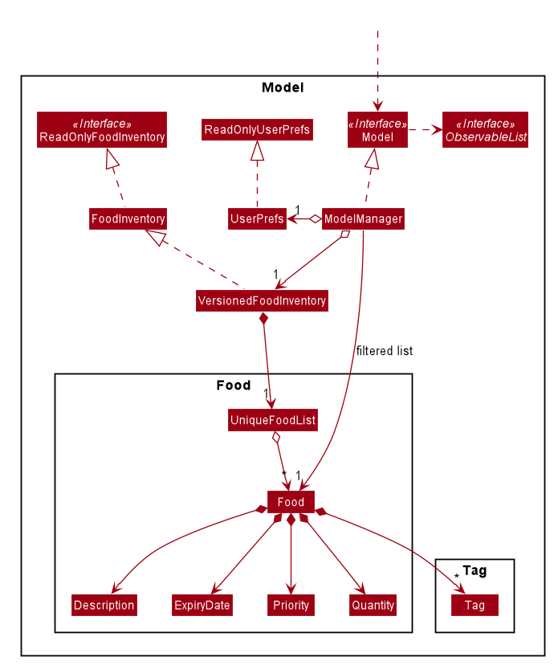

**API** : [`Model.java`](https://github.com/AY2021S1-CS2103T-F13-4/tp/blob/master/src/main/java/seedu/simplykitchen/model/Model.java)

The `Model`,

* stores a `UserPref` object that represents the user’s preferences.
* stores the food inventory data.
* exposes an unmodifiable `ObservableList<Food>` that can be 'observed' e.g. the UI can be bound to this list so that the UI automatically updates when the data in the list change.
* does not depend on any of the other three components.

:information_source: **Note:** An alternative (arguably, a more OOP) model is given below. It has a `Tag` list in the `FoodInventory`, which `Food` references. This allows `FoodInventory` to only require one `Tag` object per unique `Tag`, instead of each `Food` needing their own `Tag` object. 

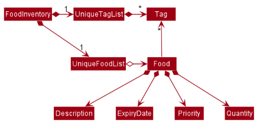

### Storage component

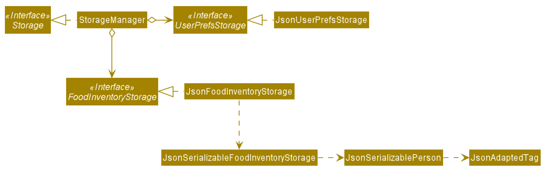

**API** : [`Storage.java`](https://github.com/AY2021S1-CS2103T-F13-4/tp/blob/master/src/main/java/seedu/simplykitchen/storage/Storage.java)

The `Storage` component,
* can save `UserPref` objects in json format and read it back.
* can save the food inventory data in json format and read it back.

### Common classes

Classes used by multiple components are in the `seedu.simplykitchen.commons` package.

<a href="https://ay2021s1-cs2103t-f13-4.github.io/tp/DeveloperGuide.html">^ Back to top</a>

--------------------------------------------------------------------------------------------------------------------

## **Implementation**

This section describes some noteworthy details on how certain features are implemented.

### Undo/Redo feature

#### Implementation

The feature is implemented with a `VersionedFoodInventory`. The `VersionedFoodInventory` contains the different states of the food inventory. The states are stored in a `foodInventoryStateList` and the current state is tracked with a `currentStatePointer`. It also implements the following methods:

* `VersionedFoodInventory#commit()` — Saves the current food inventory state in its states list.
* `VersionedFoodInventory#undo()` — Restores the previous food inventory state from its states list.
* `VersionedFoodInventory#redo()` — Restores a previously undone food inventory state from its states list.

These operations are exposed in the `Model` interface as `Model#commitFoodInventory()`, `Model#undoFoodInventory()` and `Model#redoFoodInventory()` respectively.

Given below is an example usage scenario and how the undo/redo mechanism behaves at each step.

Step 1. The user launches the application for the first time. The `VersionedFoodInventory` will be initialized with the initial food inventory state, and the `currentStatePointer` pointing to that single food inventory state.

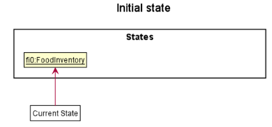

Step 2. The user executes `delete 5` command to delete the 5th food item in the food inventory. The `delete` command calls `Model#commitFoodInventory()`, causing the modified state of the food inventory after the `delete 5` command executes to be saved in the `foodInventoryStateList`, and the `currentStatePointer` is shifted to the newly inserted food inventory state.

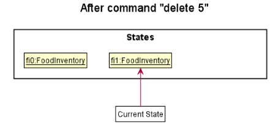

Step 3. The user executes `add d/Donut …​` to add a new food item. The `add` command also calls `Model#commitFoodInventory()`, causing another modified food inventory state to be saved into the `foodInventoryStateList`.

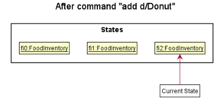

:information_source: **Note:** If a command fails its execution, it will not call `Model#commitFoodInventory()`, so the food inventory state will not be saved into the `foodInventoryStateList`.

Step 4. The user now decides that adding the food item was a mistake, and decides to undo that action by executing the `undo` command. The `undo` command will call `Model#undoFoodInventory()`, which will shift the `currentStatePointer` once to the left, pointing it to the previous food inventory state, and restores the food inventory to that state.

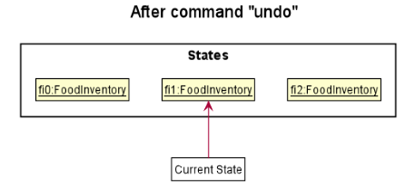

:information_source: **Note:** If the `currentStatePointer` is at index 0, pointing to the initial food inventory state, then there are no previous food inventory states to restore. The `undo` command uses `Model#canUndoFoodInventory()` to check if this is the case. If so, it will return an error to the user rather

than attempting to perform the undo.

The following sequence diagram shows how the undo operation works:

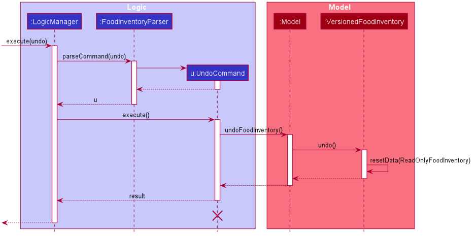

:information_source: **Note:** The lifeline for `UndoCommand` should end at the destroy marker (X) but due to a limitation of PlantUML, the lifeline reaches the end of diagram.

The `redo` command does the opposite — it calls `Model#redoFoodInventory()`, which shifts the `currentStatePointer` once to the right, pointing to the previously undone state, and restores the food inventory to that state.

:information_source: **Note:** If the `currentStatePointer` is at index `foodInventoryStateList.size() - 1`, pointing to the latest food inventory state, then there are no undone food inventory states to restore. The `redo` command uses `Model#canRedoFoodInventory()` to check if this is the case. If so, it will return an error to the user rather than attempting to perform the redo.

Step 5. The user then decides to execute the command `list`. Commands that do not modify the food inventory, such as `list`, will usually not call `Model#commitFoodInventory()`, `Model#undoFoodInventory()` or `Model#redoFoodInventory()`. Thus, the `foodInventoryStateList` remains unchanged.

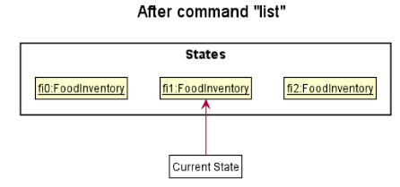

Step 6. The user executes `clear`, which calls `Model#commitFoodInventory()`. Since the `currentStatePointer` is not pointing at the end of the `foodInventoryStateList`, all food inventory states after the `currentStatePointer` will be purged. Reason: It no longer makes sense to redo the `add d/Donut …​` command.

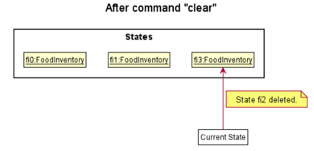

The following activity diagram summarizes what happens when a user executes a new command:

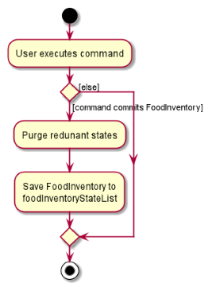

#### Design consideration:

##### Aspect: How undo & redo executes

* **Alternative 1 (current choice):** Saves the entire food inventory.
  * Pros: Easy to implement.
  * Cons: May have performance issues in terms of memory usage.

* **Alternative 2:** Individual command knows how to undo/redo by
  itself.
  * Pros: Will use less memory (e.g. for `delete`, just save the food item being deleted).
  * Cons: We must ensure that the implementation of each individual command are correct.

### Sorting feature

#### Implementation

The sorting feature consists of three commands, `SortDescCommand`, `SortExpiryCommand` and `SortPriorityCommand` which extend `Command`.

The sorting order is in accordance to what is likely the most useful order for the user.

Thus, `SortDescCommand` sorts the list of food displayed by description, then by expiry date from oldest to newest, followed by priority from `HIGH` to `LOW`.

Similarly, `SortExpiryCommand` sorts the list of food displayed by expiry date from oldest to newest, followed by priority from `HIGH` to `LOW`, followed by description.

Similarly, `SortPriorityCommand` sorts the list of food displayed by priority from `HIGH` to `LOW`, followed by expiry date from oldest to newest, followed by description.

When the commands are executed by calling `SortDescCommand#execute(Model model)` or `SortExpiryCommand#execute(Model model)` or `SortPriorityCommand#execute(Model model)`, the `versionedFoodInventory` attribute in `model` is sorted.

This is done so by calling `model#sortFoodInventory(Comparator<Food>... comparators)` method in `model` with the relevant `comparators` for sorting.

`model#setSortingComparators(Comparator<Food>[] sortingComparators)` and `userPref#setSortingComparatorsDescription(String sortingComparatorsDescription)` are then called to save the sorting information.

Sorting of the `versionedFoodInventory` attribute in `model` is reflected in the GUI when `MainWindow` calls `logic#getFilteredFoodList()`.

The following sequence diagram illustrates how the command `sortdesc` works:

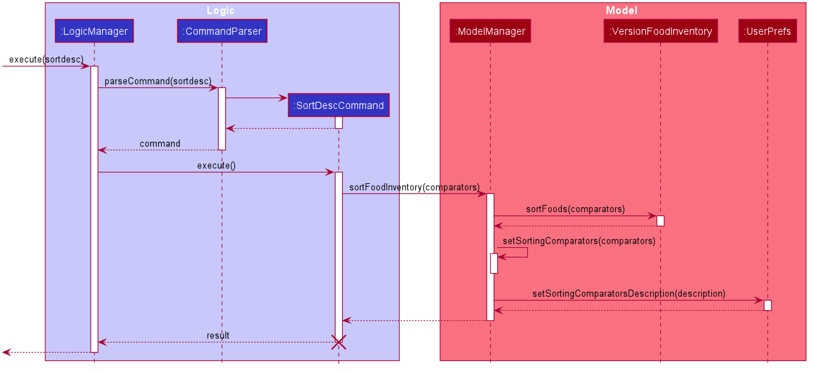

#### Design consideration:

Comparators used for sorting are stored as static variables in `ComparatorUtil`, allowing for the code to be scalable for future sorting orders.

Sorting information is stored as user preferences, to allow for the information to be retained when the application closes. Thus, the user's preferred sorting mechanism is stored, to enhance user experience.

Furthermore, this helps for items added or edited by calling `AddCommand` and `EditCommand` in the list to be updated dynamically according to the sorting mechanism. Thus, the user does not need to sort the list again.

##### Aspect: Permanence of list sorting

* **Alternative 1 (current choice):** Permanently sort lists.
  * Pros: Less hassle if a specific sorting order is preferred by the user.
  * Cons: User is unable to sort lists after executing `FindCommand` or `ListCommand`, a likely useful feature for the user, as sorting is useful for narrowed down lists.
    However, they may achieve the same result by first sorting, then executing `FindCommand` or `ListCommand`

* **Alternative 2:** Lists are sorted by description by default, and sorting by priority or expiry date are reflected in displayed lists temporarily.
  * Pros: User may sort the items on displayed lists, after executing `FindCommand` or `ListCommand`.
  * Cons: Sorting is not permanent, thus lists stored are sorted by description by default.

### Quantity Field in Food Items

A `quantity` field for food items is implemented to track the dynamic changes in the quantity of a food in the FoodInventory.

#### Implementation:

The `quantity` field has been implemented as a class in the `model.food` package.

* Quantity class contains 2 attributes: `value` and `unit`.
* The `value` has to be a positive number. It can be an integer or a decimal value.
* The `unit` in quantity field is optional. If provided, it must consist of only alphabets. Numbers, space and special characters are not permitted.
* If the unit is not provided, a default unit - `unit` - will be given.

#### Implementation Rationale:

The constraints above have been applied after careful consideration of the needs of the target audience.

* The `value` in the quantity field must be a positive value. A negative or zero value does not carry any meaning and would defeat the purpose of the feature.
* Users would want to track the quantity precisely in some cases. To allow this, SimplyKitchen accepts decimal values as the `value` attribute.
* The `value` attribute in the Quantity field has been stored as a `double` value.
* Users will have different kinds of units while tracking the quantity of their food items. For example, kg, can, bottle etc.
* To ensure the user's freedom in choosing the unit, the `unit` attribute in the Quantity class has been stored as a `String` field.
* Constraints on the content of the `unit` field have been applied to prevent misuse of the feature.
* Units are always single words and do not contain special characters or numbers. Hence, these restrictions have been enforced while accepting a quantity from the user.
* The `unit` field is optional to relieve the user of extra work of giving a unit in intuitive cases. For example, while storing the quantity of fish a unit is intuitively the number of fish.

#### Design Consideration:

##### Aspect: Implementation

* <b>Alternative 1 (current choice): </b> Value and unit stored as double and string fields in the Quantity class.
    * Pros: Easy to implement given the tight project timeframe.
    * Cons: Less OOP compared to the other alternative.
* <b>Alternative 2: </b> Value and Unit extracted to different classes. Quantity class' attributes are objects of these Value and Unit classes.
    * Pros: Improves OOP aspect of the code.
    * Cons: Unnecessarily complicates the code.

### Change quantity feature

The change quantity feature allows users to increment or decrement the quantity of a food item by a certain amount.

#### Implementation:

The `ChangeQuantityCommandParser` class parses the command by first extracting the index of the food item within the food list displayed to the user.

Next, the `amount` is parsed. It is a non-zero signed double value.

* Having a quantity change of zero is meaningless.
* The signed value is used to denote the increment or decrement of the quantity value.
* The amount value is constrained to a maximum of 2 decimal places. Any additional decimal places used will not be meaningful from the user's point of view.
* A unit is not required as it can be derived from the existing unit of the food item when the user wants to change its quantity.

A new `ChangeQuantityCommand` object is created with the extracted index and amount. It will retrieve the correct food item from the filtered list of food item provided by the `model` object.

The selected food item will have its quantity updated through the `changeQuantityCommand#updateQuantity` method.
The method will check if the new quantity is less than or equal to zero, in which it will throw a `ParseException` to notify the user that the updated quantity cannot go below 0.
If the new quantity is 0, the user will also be prompted to use the `delete` command to delete the food item instead of setting the quantity to 0.

#### Design Consideration:

Although the quantity of a food item can be changed using the `edit` command, the command will replace the old quantity value with a value supplied by the user.
This means that users have to calculate the quantity themselves and calculation errors may occur as a result.
To minimise such errors and improve the intuitiveness of commands, the `changeqty` command allows users to specify **how much the quantity should change by**.
This allows users to not be burdened by calculations and to focus more on having an accurate inventory stock level.

##### Aspect: Modifying a food item's quantity

* <b>Alternative 1 (current choice): </b> Extract the value from the `quantity` object, update it and append it to the unit of the same object.
    * Pros: Easy to implement given the tight project timeframe.
    * Cons: Violates Law of Demeter when extracting relevant fields from the `quantity` object.
* <b>Alternative 2: </b> Use a `Descriptor` class similar to the `EditFoodDescriptor` in the `EditCommand` class.
    * Pros: Improves OOP aspect of the code.
    * Cons: Unnecessarily complicates the code.
    * Cons: Only the quantity field of a `food` object is changed so a `Descriptor` class may be an overkill.
    * Cons: The Law of Demeter will still be violated and this problem is merely transferred from one place to another.

### Find feature

The find feature allows users to search for food items based on description, expiration date, priority and/or tags.

#### Implementation:

The find feature is achieved by setting a `predicate` on the `filteredList` located in `ModelManager`. This can be done using the method `ModelManager#updateFilteredFoodList(Predicate<Food> predicate)`, which uses the parameter as the `predicate`. There are four valid predicates, namely `DescriptionContainsKeywordsPredicate`, `ExpirySearchPredicate`, `PrioritySearchPredicate` and `TagSearchPredicate`, all of which implement the `Predicate<Food>` interface. Based on the user's `find` command, each of the `predicate` is generated with the relevant search parameters. Then, the `FindCommand#combinePredicates()` method will combine all the predicates into a single `predicate` and is passed to `ModelManager#updateFilteredFoodList(Predicate<Food> predicate)`.

The following sequence diagram illustrates how the command `find d/apple e/30-9-2020 p/medium t/frozen` works:

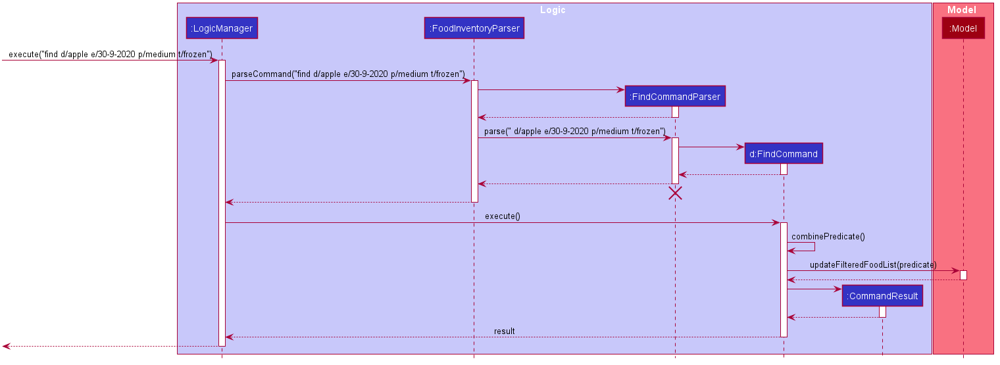

#### Find command

The `find` command uses `ArgumentMultimap` to get the parameters of each `prefix`, similar to the `add` command. The `find` command needs to have at least one `prefix` present. If a `prefix` is present, then its respective `predicate` will be generated.

The following is the class diagram for the Find feature:

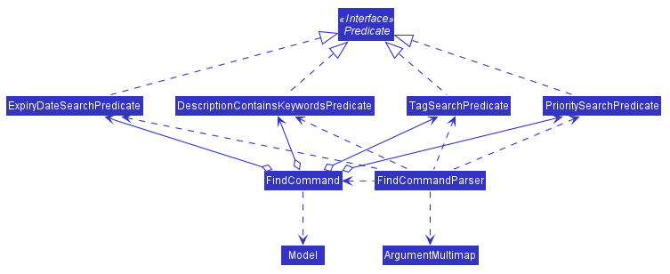

#### Implementation Rationale:

Since the user can search for food items based on either the description, expiration date, priority or tags, the `find` command should allow searching for one or more of the above combination. This increases the flexibility in the `find` command, which allows the user to define the specificity of their search.

#### Design Consideration:

Each parameter of the search can be mapped to a `predicate`. This allows for scalability in the future as when a new attribute is added to `Food`, a new `predicate` implementing the `Predicate<Food>` interface can be created to search for this field without affecting the `predicates` of the other attributes.

##### Aspect: Implementation

* <b>Alternative 1 (current choice): </b> The expiry date in the `find` command looks for a single specific expiry date.
    * Pros: Easy to implement and search is more specific.
    * Cons: If the user wants to get all the expiring food items in a certain period, multiple searches will be required.
* <b>Alternative 2: </b> The expiry date in the `find` command can be a date range.
    * Pros: Able to get all the food items that are going to expire in a certain period with one search.
    * Cons: Will need more validation to ensure the date range provided is valid.

<a href="https://ay2021s1-cs2103t-f13-4.github.io/tp/DeveloperGuide.html">^ Back to top</a>

--------------------------------------------------------------------------------------------------------------------

## **Documentation, logging, testing, configuration, dev-ops**

* [Documentation guide](Documentation.md)
* [Testing guide](Testing.md)
* [Logging guide](Logging.md)
* [Configuration guide](Configuration.md)
* [DevOps guide](DevOps.md)

<a href="https://ay2021s1-cs2103t-f13-4.github.io/tp/DeveloperGuide.html">^ Back to top</a>

--------------------------------------------------------------------------------------------------------------------

## **Appendix: Requirements**

### Product scope

**Target user profile**:

* has a need to manage kitchen food items
* prefer desktop apps over other types
* prefers typing to mouse interactions
* can type fast
* is reasonably comfortable using CLI apps

**Value proposition**: With SimplyKitchen, food inventory management is made easy.

### Glossary

* **Mainstream OS**: Windows, Linux, Unix, OS-X
* **GUI**: Graphical User Interface
* **Food inventory**: a complete list of food items stored in Simply Kitchen

*{More to be added}*

### User stories

Priorities: High (must have) - `* * *`, Medium (nice to have) - `* *`, Low (unlikely to have) - `*`

| Priority | User role (As a …)                        | Function (I want to …)                                     | Benefit (So that I can …)                                    |
| -------- | ----------------------------------------- | ---------------------------------------------------------  | ------------------------------------------------------------ |
| `* * *`  | user                                      | add food items                                             |                                                              |
| `* * *`  | user                                      | delete food items                                          |                                                              |
| `* * *`  | user                                      | edit the fields of a food item                          | change the details of the food item after adding it          |
| `* * *`  | user                                      | search for food items based on keywords of the description | find them easily                                             |
| `* * *`  | user                                      | view a list of all food items I have added                 | have a complete display of all my food items                 |
| `* * *`  | user                                      | clear all food items                                       |                                                              |
| `* * *`  | user who cares about some food items more | have different priority for different food items           | prioritise some food items                                   |
| `* * *`  | user                                 | use more intuitive commands   | be more comfortable with using the app              |
| `* * *`  | user who likes efficiency                           | search for food items based on their priorities   | know which food items belong to a certain priority          |
| `* * *`  | user                           | search for food items based on their expiry dates   | know which food items are expiring on a certain date          |
| `* * *`  | busy user                                 | view a list of all food items sorted by their priorities   | know which food items are of certain priorities              |
| `* * *`  | busy user                                 | view a list of all food items sorted by their expiry dates | know which food items are expiring first                     |
| `* * *`  | user                                      | update the quantity of food items when I use them          | have an updated record of food items available in my kitchen |
| `* * *`  | forgetful user                            | be notified of expired food items          | know which food items are expired and can be thrown away      |
| `* * *`  | forgetful user                            | be notified of expiring food items         | know which food items are expiring soon and use them before they expired     |
| `* * *`    | user                                      | undo and redo my actions                                               | easily fix the mistakes when using the application                  |
| `* *`     | user                                      | tag food items                                             | add additional information pertaining/relating to them       |
| `* *`  | user                           | search for food items based on their tags   | know which food items are tagged with a certain information          |
| `*`  | user                           | see some sample data populated in the app   | understand how the app will look like and what benefits it has       |

*{More to be added}*

### Use cases

For all use cases, the **System** is `SimplyKitchen` and the **Actor** is the `User`, unless otherwise specified.

#### UC01: Add a food item

**Guarantees:** The food item is added into the food inventory.

**MSS:**

**1.**  User requests to add a food item.

**2.**  SimplyKitchen adds the food item to the food inventory and displays a success message.

Use case ends.

**Extensions:**

**1a.** SimplyKitchen detects an error in the user's food item.

 * **1a1.** SimplyKitchen displays an error message and prompts the user to enter a correct food item.

 * **1a2.** User enters another food item.

   Steps **1a1.** - **1a2.** are repeated until the food item entered is correct.

   Use case resumes from step **2**.

 

#### UC02: Delete a food item

**Precondition:** The food item to be deleted is currently in the food inventory.

**Guarantees:** If a food item is specified, the food item will be deleted from the food inventory.

**MSS:**

**1.** User requests to <ins>find a food item (UC05)</ins> or <ins>list all food items (UC06)</ins>.

**2.** SimplyKitchen displays a list of food items.

**3.** User requests to delete a food item from the list.

**4.** SimplyKitchen deletes the food item from the food inventory and displays a success message.

Use case ends.

**Extensions:**

**2a.** The list is empty.

Use case ends.

**3a.** SimplyKitchen detects an invalid index corresponding to the food item in the list.

 * **3a1.** SimplyKitchen displays an error message and prompts the user to enter a correct index.

 * **3a2.** User requests to delete another index corresponding to the food item in the list.

   Steps **3a1.** - **3a2.** are repeated until the index entered is correct.

   Use case resumes from step **4**.

 

#### UC03: Edit a food item

**Precondition:** The food item to be edited is currently in the food inventory.

**Guarantees:** The food item is edited from the food inventory.

**MSS:**

**1.** User requests to <ins>find a food item (UC05)</ins> or <ins>list all food items (UC06)</ins>.

**2.** SimplyKitchen displays a list of food items.

**3.** User requests to edit a food item from the list.

**4.** SimplyKitchen edits the food item in the food inventory and displays a success message.

Use case ends.

**Extensions:**

**2a.** The list is empty.

Use case ends.

**3a.** SimplyKitchen detects an invalid index corresponding to the food item in the list.

 * **3a1.** SimplyKitchen displays an error message and prompts the user to enter a correct index.

 * **3a2.** User requests to edit another food item in the list.

   Steps **3a1.** - **3a2.** are repeated until the index entered is correct.

   Use case resumes from step **4**.

**3a.** SimplyKitchen detects an error in the user's edited food item.

 * **3a1.** SimplyKitchen displays an error message and prompts the user to enter a correct edited food item.

 * **3a2.** User enters another edited food item.

   Steps **3a1.** - **3a2.** are repeated until the edited food item entered is correct.

   Use case resumes from step **4**.

 

#### UC04: Change the quantity of a food item

**Guarantees:**  The food item has its quantity changed.

**MSS:**

**1.** User requests to <ins>find a food item (UC05)</ins> or <ins>list all food items (UC06)</ins>.

**2.** SimplyKitchen displays a list of food items.

**3.** User requests to change the quantity of a food item.

**4.** SimplyKitchen changes the quantity of the food item in the food inventory and displays a success message.

Use case ends.

**Extensions:**

**2a.** The list is empty.

Use case ends.

**3a.** SimplyKitchen detects an invalid index corresponding to the food item in the list.

 * **3a1.** SimplyKitchen displays an error message and prompts the user to enter a correct index.

 * **3a2.** User requests to change the quantity of another food item in the list.

   Steps **3a1.** - **3a2.** are repeated until the index entered is correct.

   Use case resumes from step **4**.

**3a.** SimplyKitchen detects an error in the user's input quantity.

 * **3a1.** SimplyKitchen displays an error message and prompts the user to enter a correct input quantity.

 * **3a2.** User enters another input quantity.

   Steps **3a1.** - **3a2.** are repeated until the input quantity is correct.

   Use case resumes from step **4**.

 

#### UC05: Find a food item

**Guarantees:**  All food items in the food inventory that match the query are listed.

**MSS:**

**1.** User requests to list food items according to the description, priority, expiration date and/or tag.

**2.** SimplyKitchen displays all food items matching the search query.

Use case ends.

**Extensions:**

**1a.** SimplyKitchen detects an error in the search query.

 * **1a1.** SimplyKitchen displays an error message and prompts the user to enter a correct search query.

 * **1a2.** User enters a new search query.

   Steps **1a1.** - **1a2.** are repeated until the search query entered is correct.

   Use case resumes from step **2**.

 

#### UC06: List all food items

**Guarantees:**  All food items in the food inventory are listed.

**MSS:**

**1.** User requests to list all food items in the food inventory.

**2.** SimplyKitchen displays all food items in the food inventory.

Use case ends.

 

#### UC07: Clear all food items

**Guarantees:**  All food items in the food inventory are cleared.

**MSS:**

**1.** User requests to clear all food items in the food inventory.

**2.** SimplyKitchen removes all food items in the food inventory and displays a success message.

Use case ends.

 

#### UC08: Sort food items by expiry date

**Guarantees:** The food items in the food list are sorted by expiry date.

**MSS:**

**1.** User requests to sort the food list by expiry date.

**2.** SimplyKitchen displays the food list sorted by expiry date.

Use case ends.

**Extensions:**

**2a.** The list is empty.

Use case ends.

 

#### UC09: Sort food items by priority

**Guarantees:** The food items in the food list are sorted by priority.

**MSS:**

**1.** User requests to sort the food list by priority.

**2.** SimplyKitchen displays the food list sorted by priority.

Use case ends.

**Extensions:**

**2a.** The list is empty.

Use case ends.

 

#### UC10: Sort food items by description

**Guarantees:** The food items in the food list are sorted by description.

**MSS:**

**1.** User requests to sort the food list by description.

**2.** SimplyKitchen displays the food list sorted by description.

Use case ends.

**Extensions:**

**2a.** The list is empty.

Use case ends.

 

#### UC11: Undo most recent undoable command

**Guarantees** The most recent undoable command (add, delete, edit, sort, clear) requested will be undone.

**MSS:**

**1.** User requests to undo.

**2.** SimplyKitchen displays the food list before the most recent undoable command was requested.

Use case ends.

**Extensions:**

**2a.** No undoable commands were executed.

Use case ends.

 

#### UC12: Redo most recent undo command

**Guarantees** It redoes the most recent undo command.

**MSS:**

**1.** User requests to redo.

**2.** SimplyKitchen displays the food list after the most recent undo command was requested.

Use case ends.

**Extensions:**

**2a.** No undo commands were executed.

Use case ends.

 

*{More to be added}*

### Non-Functional Requirements

* The app should work on any mainstream OS as long as it has Java 11 or above installed.
* The app should be able to hold up to 1000 food items without a noticeable sluggishness in performance for typical usage.
* A user with above average typing speed for regular English text (i.e. not code, not system admin commands) should be able to accomplish most of the tasks faster using commands than using the mouse.
* A user should be able to see food items clearly on the GUI to facilitate command typing.

*{More to be added}*

<a href="https://ay2021s1-cs2103t-f13-4.github.io/tp/DeveloperGuide.html">^ Back to top</a>

--------------------------------------------------------------------------------------------------------------------

## **Appendix: Instructions for manual testing**

Given below are instructions to test the app manually.

:information_source: **Note:** These instructions only provide a starting point for testers to work on;
testers are expected to do more *exploratory* testing.

### Launch and shutdown

1. Initial launch

   1. Download the jar file and copy into an empty folder

   1. Double-click the jar file Expected: Shows the GUI with a set of sample contacts. The window size may not be optimum.

1. Saving window preferences

   1. Resize the window to an optimum size. Move the window to a different location. Close the window.

   1. Re-launch the app by double-clicking the jar file. 
       Expected: The most recent window size and location is retained.

1. _{ more test cases …​ }_

### Deleting a food item

1. Deleting a food item while all food items are being shown

   1. Prerequisites: List all food items using the `list` command. Multiple food items in the list.

   1. Test case: `delete 1` 
      Expected: First contact is deleted from the list. Details of the deleted contact shown in the status message. Timestamp in the status bar is updated.

   1. Test case: `delete 0` 
      Expected: No food item is deleted. Error details shown in the status message. Status bar remains the same.

   1. Other incorrect delete commands to try: `delete`, `delete x`, `...` (where x is larger than the list size) 
      Expected: Similar to previous.

1. _{ more test cases …​ }_

### Saving data

1. Dealing with missing/corrupted data files

   1. _{explain how to simulate a missing/corrupted file, and the expected behavior}_

1. _{ more test cases …​ }_

<a href="https://ay2021s1-cs2103t-f13-4.github.io/tp/DeveloperGuide.html">^ Back to top</a>

