# Table of contents

* [1. Introduction](#1-introduction)
* [2. About this document](#2-about-this-document)
* [3. Quick start](#3-quick-start)
* [4. Application layout](#4-application-layout)
* [5. Features](#5-features)
  * [5.1. Basic commands](#51-basic-commands)
    * [5.1.1. Adding a food item](#511-adding-a-food-item)
    * [5.1.2. Editing a food item](#512-editing-a-food-item)
    * [5.1.3. Deleting a food item](#513-deleting-a-food-item)
    * [5.1.4. Changing the quantity of a food item](#514-changing-the-quantity-of-a-food-item)
  * [5.2. Sorting commands](#52-sorting-commands)  
    * [5.2.1. Sorting food items by description](#521-sorting-food-items-by-description)
    * [5.2.2. Sorting food items by expiry date](#522-sorting-food-items-by-expiry-date)
    * [5.2.3. Sorting food items by priority](#523-sorting-food-items-by-priority)
  * [5.3. Viewing commands](#53-viewing-commands)    
    * [5.3.1. Listing all food items](#531-listing-all-food-items)
    * [5.3.2. Finding food items](#532-finding-food-items)
    * [5.3.3. Viewing expired food items](#533-viewing-expired-food-items)
  * [5.4. Miscellaneous commands](#54-miscellaneous-commands)
    * [5.4.1. Undoing previous command](#541-undoing-previous-command)
    * [5.4.2. Redoing previously undone command](#542-redoing-previously-undone-command)     
    * [5.4.3. Clearing all entries](#543-clearing-all-entries)
    * [5.4.4. Viewing help](#544-viewing-help)
    * [5.4.5. Exiting the program](#545-exiting-the-program)
  * [5.5. Saving the data](#55-saving-the-data)
* [6. Upcoming features](#6-upcoming-features-coming-in-v20)
  * [6.1. Storage](#61-storage)
    * [6.1.1. Adding a storage location for a food item](#611-adding-a-storage-location-for-a-food-item)
    * [6.1.2. Moving a food item ](#612-moving-a-food-item)
  * [6.2. Sort command](#62-sort-command)
    * [6.2.1. Sorting by descending description](#621-sorting-by-descending-description)
    * [6.2.2. Checking sorting order](#622-checking-sorting-order)
  * [6.3. Find command](#63-find-command)
    * [6.3.1. Finding food items based on partial search fields](#631-finding-food-items-based-on-partial-search-fields)
* [7. Frequently asked questions (FAQs)](#7-frequently-asked-questions-faqs)
* [8. Command summary](#8-command-summary)
* [9. Glossary](#9-glossary)

--------------------------------------------------------------------------------------------------------------------

# 1. Introduction

Welcome to SimplyKitchen, a desktop application for food inventory management suited for household individuals who manage their kitchens' food items.

SimplyKitchen is developed by 5 dedicated students who hope to assist and alleviate the problems you might encounter while managing your food inventory.
With intuitive and practical features, SimplyKitchen can get your food management tasks done faster and more efficiently!

With a Command Line Interface (CLI), SimplyKitchen is best suited to those who can type fast and prefer using a keyboard.
SimplyKitchen also uses a Graphical User Interface (GUI) to provide the ideal user experience.

SimplyKitchen hopes to empower you to work towards a Tidy Kitchen, with Tiny Wastage!

<a href="https://ay2021s1-cs2103t-f13-4.github.io/tp/UserGuide.html#">^ Back to top</a>

--------------------------------------------------------------------------------------------------------------------

# 2. About this document

This document is a User Guide meant to assist you in using SimplyKitchen to manage your food inventory.

The [quick start](#quick-start) section guides you in setting up and launching the SimplyKitchen application on your computer.

The [application layout](#4-application-layout) section provides an overview of how the application looks like on your computer.

The [features](#features) section helps you understand and use the features of SimplyKitchen.
It gives clear examples for each feature to ensure that the purpose and constraints of the feature are evident.

The [upcoming features](#6-upcoming-features-coming-in-v20) section provides a peek on the future expansion of SimplyKitchen.

The [FAQs](#faq) section contains some Frequently Asked Questions with regard to SimplyKitchen.

The [command summary](#command-summary) section acts as a quick reference point for all the features of SimplyKitchen.

Finally, the [glossary](#9-glossary) section provides explanations for commonly used terms.

<a href="https://ay2021s1-cs2103t-f13-4.github.io/tp/UserGuide.html#">^ Back to top</a>

--------------------------------------------------------------------------------------------------------------------

# 3. Quick start

* Ensure that you have `Java 11` or above installed on your computer.
* Download the most recent `SimplyKitchen.jar` file from [this link](https://github.com/AY2021S1-CS2103T-F13-4/tp/releases).
* Copy the downloaded jar file into a folder which will be your _*home folder*_ for SimplyKitchen.
* Double click on the `SimplyKitchen.jar` file to launch the app. An app window similar to the one shown in Figure 1 should appear in a few seconds.

  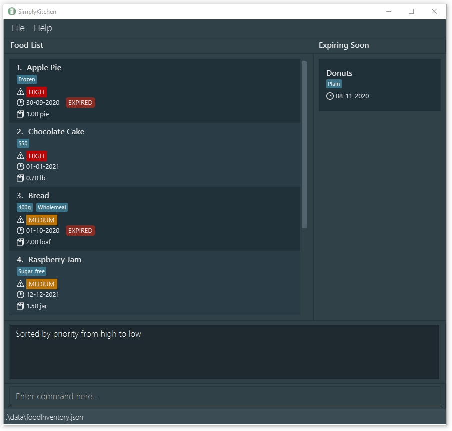
  
  
Figure 1: SimplyKitchen app window

* Notice how the application is populated with some sample data. Some food items from the sample data are expired and displayed in a separate pop-up window as shown in Figure 2.
 
  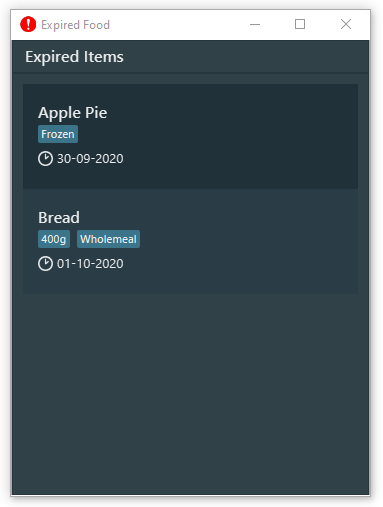

  
Figure 2: SimplyKitchen pop-up window listing all the expired food items

* Start using the application by typing a command in the command box at the bottom. For example, typing `help` and then pressing `Enter` will open the help window.
* Refer to the [features section in this guide](#features) for help on how to use the app.

<a href="https://ay2021s1-cs2103t-f13-4.github.io/tp/UserGuide.html#">^ Back to top</a>

--------------------------------------------------------------------------------------------------------------------

# 4. Application layout

This section provides an introduction to SimplyKitchen's Graphical User Interface (GUI) layout. 

The figure below (Figure 3) details the main components:

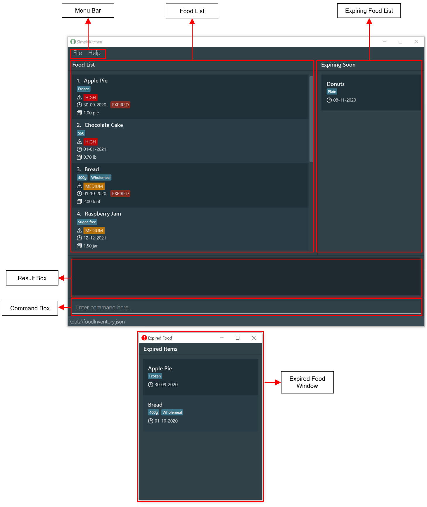
  

Figure 3: Main components of SimplyKitchen

  
The table below provides the descriptions of the main components:

Component           | Description
--------------------|-----------------------------------------------------------------------------------------
Menu Bar            | A top bar with relevant accessible tabs for you to click on
Food List           | A list of your food items
Expiring Food List  | A list of your expiring food items
Expired Food Window | A pop-up window containing a list of your expired food items
Result Box          | A panel which displays the response messages relevant to you while using the application
Command Box         | A text field for you to type your commands
 
The figure below (Figure 4) provides a breakdown of the food item components displayed in the food list:

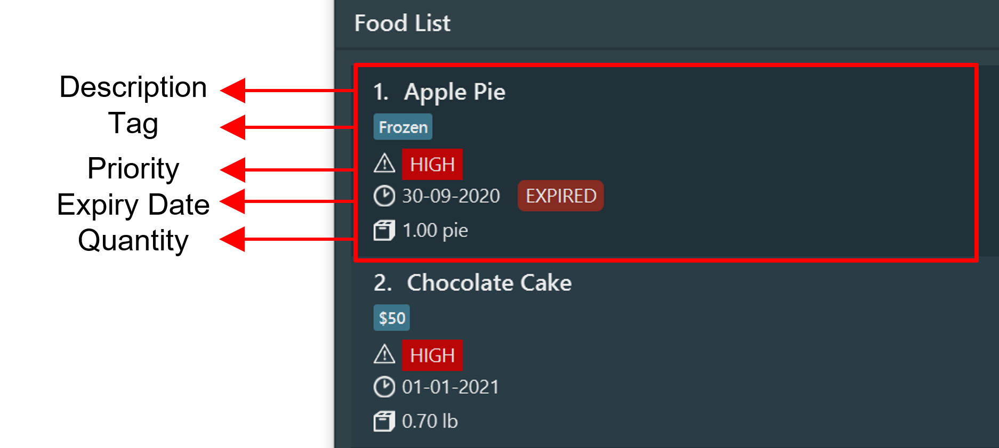

Figure 4: Components of a food item

The table below provides the descriptions of the displayed food item components:

Component   | Description
------------|-------------------------------------------------------------
Description | The description of a food item
Tag         | A tag to a food item (e.g. `spicy`, `for family`, `vegan`)
Priority    | The priority of a food item (i.e. `high`, `medium` or `low`)
Expiry Date | The expiry date of a food item
Quantity    | The quantity of a food item (e.g. `1 loaf`, `3.5 g`)
  

<a href="https://ay2021s1-cs2103t-f13-4.github.io/tp/UserGuide.html#">^ Back to top</a>

--------------------------------------------------------------------------------------------------------------------

# 5. Features

This section contains information on the features of SimplyKitchen and the respective commands that you can use.

**:information_source: Notes about the command format:** 

* Items with the format `lower_case/` refer to prefixes. They denote the different parameters. 
  The table below provides the descriptions of the relevant prefixes.
 
  Prefix | Description
  -------|-----------------------------------
  `a/`   | Amount of a food item to change by
  `d/`   | Description of a food item
  `e/`   | Expiry date of a food item
  `p/`   | Priority of a food item
  `q/`   | Quantity of a food item
  `t/`   | Tags to a food item

* Words in `UPPER_CASE` refer to information you have to provide. 
  e.g. In `add d/DESCRIPTION`, `DESCRIPTION` refers to the food description you are adding, such as `add d/cucumber`.

* Items in square brackets are optional. 
  e.g `d/DESCRIPTION e/EXPIRY_DATE [p/PRIORITY]` can be used as `d/bread e/30-09-2020` or as `d/bread e/30-09-2020 p/low`.

* Parameters can be in any order. 
  e.g. If the command specifies `d/DESCRIPTION e/EXPIRY_DATE`, `e/EXPIRY_DATE d/DESCRIPTION` is also acceptable.

* Ellipsis after a parameter indicates that multiple entries of that parameter can be given. 
  e.g. In `[t/TAG]...`, the command can have zero or more tags, such as `t/spicy t/mustard`.

* Parameters without an ellipsis can only appear once. 
  e.g. `d/Apple Jam d/Apple Juice` and `p/low p/medium` are not allowed.

* Extra whitespaces leading and succeeding a parameter will be ignored. 
  e.g. The description parameter `d/    cashew  nuts   ` will be stored as `d/cashew  nuts`.

<a href="https://ay2021s1-cs2103t-f13-4.github.io/tp/UserGuide.html#">^ Back to top</a>

## 5.1. Basic commands

The commands in this section can be used to manipulate food items.

### 5.1.1. Adding a food item

The `add` command stores a food item in your food inventory, so that you can start tracking it.
You can then access the food item later on for editing, deleting etc.

**Format:** `add d/DESCRIPTION e/EXPIRY_DATE q/QUANTITY [p/PRIORITY] [t/TAG]…`

* A food item with the same description, expiry date and tags as another food item is considered a duplicate.
* The description and tag can contain a maximum of 50 and 72 characters respectively, including whitespaces.
* The description and tag are case-insensitive (i.e `d/Apple e/30-12-2020 q/1 t/Red` is the same item as `d/apple e/30-12-2020 q/2 t/red`).
* The expiry date must be in the format of `DD-MM-YYYY` or `DD/MM/YYYY`. The year must be between 2020 and 2120, both inclusive.
* The quantity consists of 2 entities - `value` and `unit`. The `value` should come before the `unit`.
  * The `value` is compulsory. It must be a positive number with a maximum of 2 decimal places. The maximum value allowed is 100,000.00.
  * The `unit` is optional. If provided, it must consist of only alphabets. Numbers, spaces and special characters are not allowed. If not provided, the default unit - `unit` - will be given.
    The maximum length of the quantity unit is 20 characters, including whitespaces.
* The priority can either be `high`, `medium` or `low` and is optional. If a priority is not specified, the default priority will be set to `LOW`.
* The tag can contain `alphanumeric`, `whitespaces` and these special characters: `#$%&-()`.
  * Tags with only whitespace(s) are not allowed.
  * A food item can have any number of tags (including 0).

**Examples:**
* `add d/Canned tuna e/1-1-2021 q/1.5 can p/low` adds an item having description `Canned tuna`, expiry date `01-01-2021`, quantity `1.50 can` and priority `LOW`.
* `add d/Banana pie e/20-11-2020 q/2 p/medium t/$15 t/contains nuts` adds an item having description `Banana pie`, expiry date `20-11-2020`, quantity `2.00 unit`, priority `MEDIUM`, and tags `$15` and `contains nuts`.

The result of executing `add d/Banana pie e/20-11-2020 q/2 p/medium t/$15 t/contains nuts` is shown in Figure 5 and Figure 6.

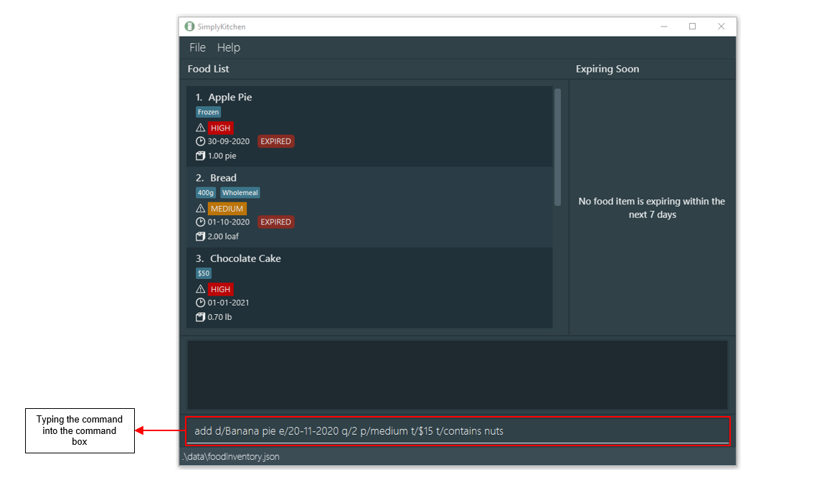

Figure 5: The red box shows the command being typed into the command box.

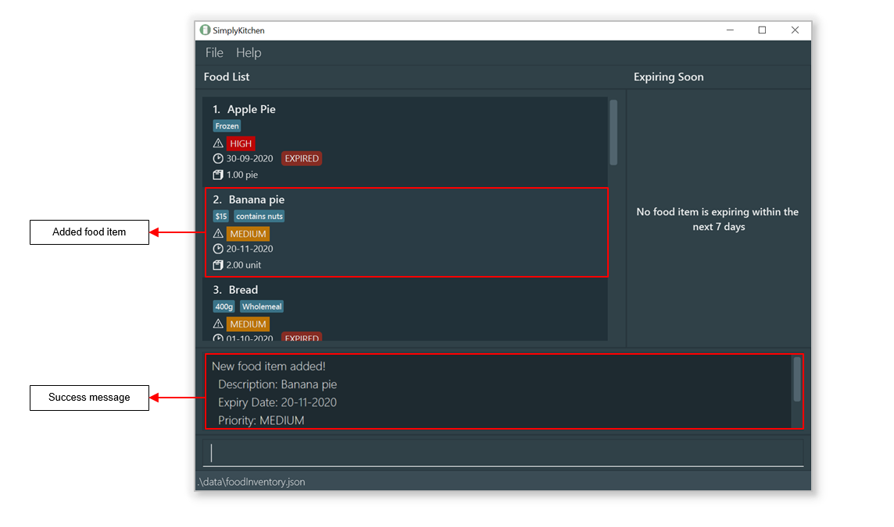

Figure 6: The red box shows the new food item being added to the food list.

<a href="https://ay2021s1-cs2103t-f13-4.github.io/tp/UserGuide.html#">^ Back to top</a>

### 5.1.2. Editing a food item

The edit command edits the details of an existing food item in your food inventory.
If an entry is incorrect, you can easily edit the entry without deleting and re-adding the food item.

**Format:** `edit INDEX [d/DESCRIPTION] [e/EXPIRY_DATE] [q/QUANTITY] [p/PRIORITY] [t/TAG]...`

* It edits the food item at the specified `INDEX`.
  * The index refers to the index number shown in the displayed food list.
  * The index **must be a positive integer** 1, 2, 3, …
* You must specify at least one parameter (other than the `INDEX`) for this command to be valid.
* Existing values will be replaced with the values you input.
* When editing tags, the existing tags of the food item will be removed i.e adding of tags is not cumulative.
  * You can remove all the tags of a food item by typing `t/` without specifying any tags after it.
* Similar to the [add](#511-adding-a-food-item) command, a food item with the same description, expiry date and tags as another food item is considered a duplicate.

**:information_source: Note about the parameters:** 

The constraints for the individual parameters of this command (description, expiry date, quantity, priority and tags) are the same as those for the [`add`](#adding-a-food-item) command.

**Examples:**
* `edit 1 d/baked beans e/1-1-2020` edits the food description and expiry date of the 1st food item to be `baked beans` and `01-01-2020` respectively.
* `edit 2 d/canned tuna q/0.5 can t/` edits the food description of the 2nd food item to be `canned tuna`, quantity to `0.50 can` and clears all existing tags.

<a href="https://ay2021s1-cs2103t-f13-4.github.io/tp/UserGuide.html#">^ Back to top</a>

### 5.1.3. Deleting a food item

The `delete` command deletes a specified food item from your food inventory, so that you can stop tracking it.

**Format:** `delete INDEX`

* It deletes the food item at the specified `INDEX`.
  * The index refers to the index number shown in the displayed food list.
  * The index **must be a positive integer** 1, 2, 3, …

**Examples:**
* `list` followed by `delete 2` deletes the 2nd food item in your food inventory.
* `find d/tuna` followed by `delete 1` deletes the 1st food item from the result of the `find` command.

<a href="https://ay2021s1-cs2103t-f13-4.github.io/tp/UserGuide.html#">^ Back to top</a>

### 5.1.4. Changing the quantity of a food item

The `changeqty` command changes the quantity of an existing food item in your food inventory without you having to calculate it yourself.
Use this command if you have bought new food items or used/discarded some existing food items.

**Format:** `changeqty INDEX a/AMOUNT`

* The index refers to the index number shown in the displayed food list.
  * The index **must be a positive integer** 1, 2, 3, …
* The amount is the quantity of a food item you want to change by.
  * The amount is a non-zero signed number with a maximum of 2 decimal places. It should be more than -100,000.00 and less than +100,000.00, but not 0.
  * Indicate a positive or negative sign before the value to show increment or decrement respectively.
  * Do not add a whitespace between the sign and the value (e.g. `+1` is acceptable but not `+ 1`).
* Do not specify the unit of the food item. The existing unit will be used instead.

**:information_source: Constraint on the size of amount:** 

Choose an amount such that the **final** quantity of the food item is not less than or equal to 0, or more than 100,000.

For example, you have already added 5 grams of flour in your food inventory with the [`add`](#511-adding-a-food-item) command.
You can use the `changeqty` command to add 0.01 to 99,995.00 grams of flour or subtract 0.01 to 4.99 grams of flour.
If you have used up all the flour, use the [`delete`](#513-deleting-a-food-item) command instead.

**Examples:**
* `list` followed by `changeqty 1 a/+1` increases the quantity of the 1st food item in your food inventory by 1.
* `find d/tuna` followed by `changeqty 2 a/-2.50` decreases the quantity of the 2nd food item from the result of the `find` command by 2.50.

<a href="https://ay2021s1-cs2103t-f13-4.github.io/tp/UserGuide.html#">^ Back to top</a>

## 5.2. Sorting commands

The commands in this section can be used to sort the food list. Before the list of food items is sorted for the first time, it will be ordered by `description` by default. 
Refer to [`5.2.1. Sorting food items by description`](#521-sorting-food-items-by-description) for a detailed explanation of sorting by description.

### 5.2.1. Sorting food items by description

The `sortdesc` command sorts the list of food items by description, allowing you to view your food items by description.

**Format:** `sortdesc`

* Sorting by description consists of first sorting lexicographically, then comparing the descriptions' first characters.
* If the first characters of two food items' descriptions are the same letters (i.e. `apple` and `Acorn`), descriptions with upper case first characters will be ordered lower compared to descriptions with lower case first characters.
* Food items of the same description will be sorted by expiry date from oldest to newest.
* Food items of the same description and same expiry date will be sorted by priority from high to low.

**Example:**

A possible valid ordering of description is shown in Figure 7.

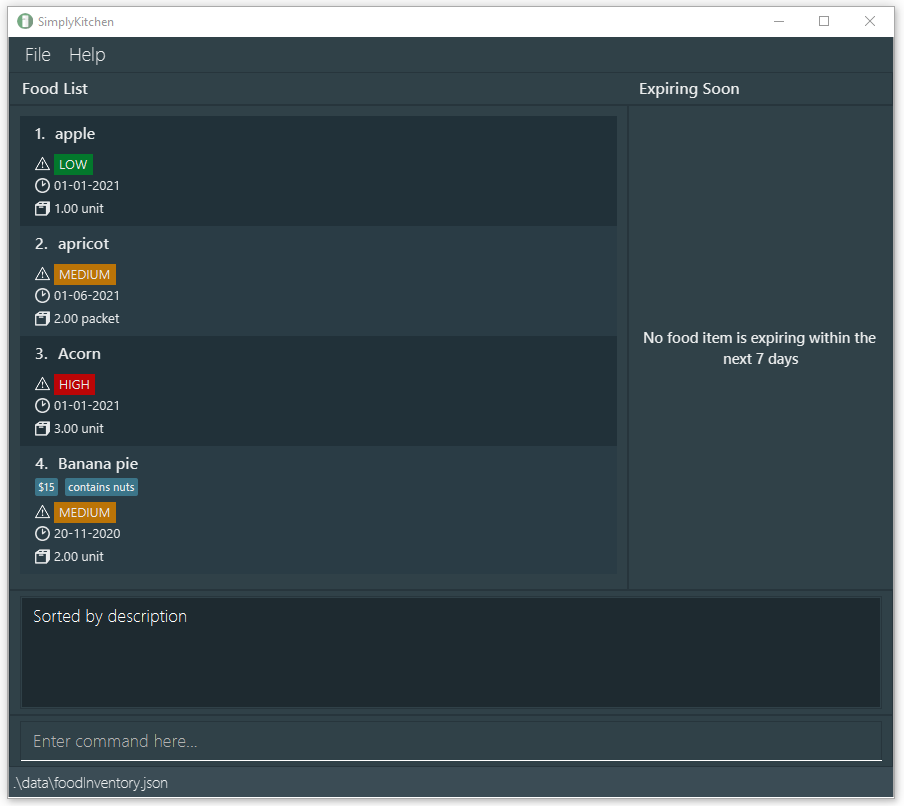

Figure 7: Food items sorted by description

<a href="https://ay2021s1-cs2103t-f13-4.github.io/tp/UserGuide.html#">^ Back to top</a>

### 5.2.2. Sorting food items by expiry date

The `sortexpiry` command sorts the list of food items by expiry date from oldest to newest. With this, you can easily tell which food items are expiring first.

**Format:** `sortexpiry`

* Food items of the same expiry date will be sorted by priority from high to low.
* Food items of the same expiry date and same priority will be sorted by description.

**Example:**

A possible valid ordering of expiry date is shown in Figure 8.

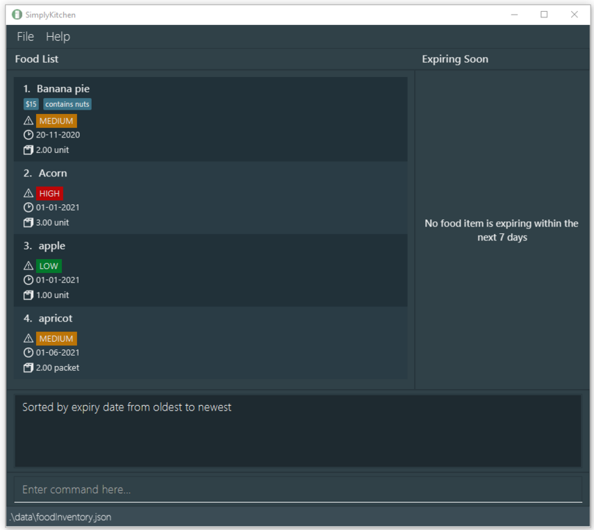

Figure 8: Food items sorted by expiry date

<a href="https://ay2021s1-cs2103t-f13-4.github.io/tp/UserGuide.html#">^ Back to top</a>

### 5.2.3. Sorting food items by priority

The `sortpriority` command sorts the list of food items by priority from high to low. With this, you can easily tell which food items have higher priority.

**Format:** `sortpriority`

* Food items of the same priority will be sorted by expiry date from oldest to newest.
* Food items of the same priority and same expiry date will be sorted by description.

**Example:**

A possible valid ordering of priority is shown in Figure 9.

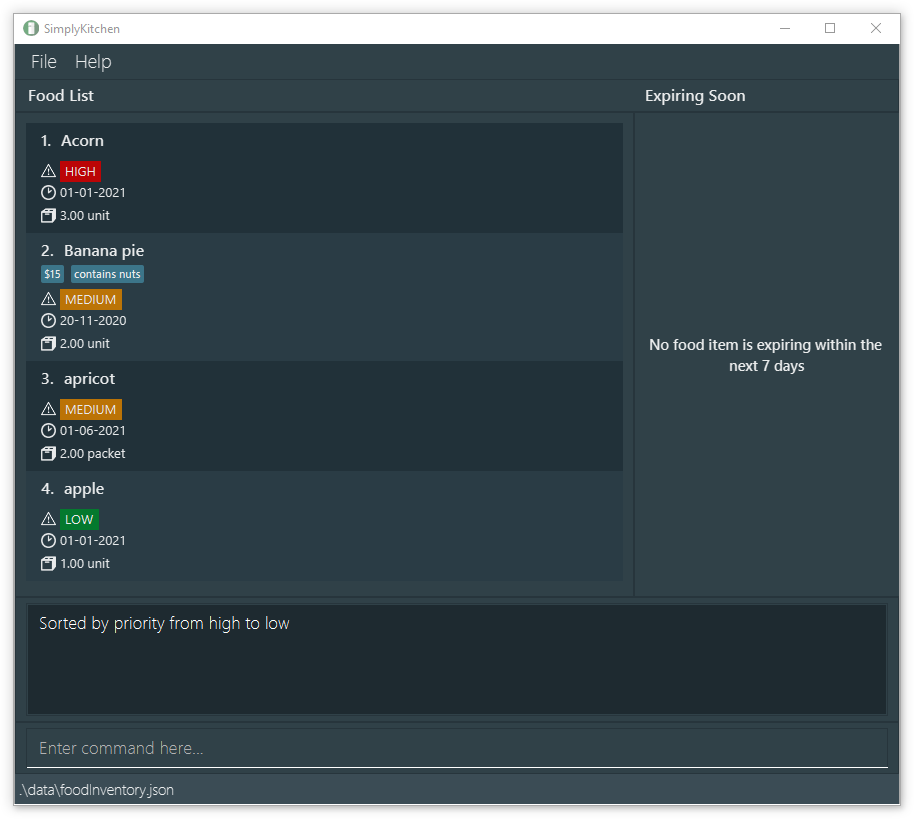

Figure 9: Food items sorted by priority

<a href="https://ay2021s1-cs2103t-f13-4.github.io/tp/UserGuide.html#">^ Back to top</a>

## 5.3. Viewing commands

The commands in this section can used to show different types of food items on the food list.

### 5.3.1. Listing all food items

The `list` command shows the complete list of food items in your food inventory.
This command is suitable if you want to get a glimpse of all your food items currently in your kitchen.

**Format:** `list`

<a href="https://ay2021s1-cs2103t-f13-4.github.io/tp/UserGuide.html#">^ Back to top</a>

### 5.3.2. Finding food items

The `find` command searches for food items in your food inventory and displays the result on your food list. You can easily find a specific food item, or a group of food items.
The search will return food items with matching description, priority, expiry date and tags (i.e `[d/DESCRIPTION OR [MORE_DESCRIPTIONS]...] AND [p/PRIORITY] AND [e/EXPIRY DATE] AND [t/TAG] OR ...`).

**Format:** `find [d/DESCRIPTION [MORE_DESCRIPTIONS]...] [e/EXPIRY DATE] [p/PRIORITY] [t/TAG]...`

* You must specify at least one parameter for this command to be valid.
* The search is case-insensitive (e.g `fish` will match `Fish`).
* Only full words in description will be matched (e.g. `fis` will not match `fish`).
* Food items with description matching at least one keyword (i.e `OR` search) will be returned (e.g. `fish` will return `Fish Cake`, `Tuna Fish`).
* The description and tag can contain a maximum of 50 and 72 characters respectively, including whitespaces.
* The expiry date must be in the format of `DD-MM-YYYY` or `DD/MM/YYYY`. The year must be between 2020 and 2120, both inclusive.
* The priority can either be `high`, `medium` or `low`.
* The tag can contain `alphanumeric`, `whitespaces` and these special characters: `#$%&-()`.
  * Tags with only whitespace(s) are not allowed.
  * Only full tags will be matched e.g. `nuts` will not match `contains nuts`.
  * Food items with tags matching at least one of the search tags (i.e `OR` search) will be returned (e.g. `frozen` will return all food items with tags `frozen` regardless of their other tags).

**Examples:**
* `find d/chocolate` can return `Chocolate Pie` and `Chocolate Cake`.
* `find d/apple tuna` can return `Apple Pie` and `Tuna Can`.
* `find e/30-12-2020` returns all food items with expiry date on `30-12-2020`.
* `find d/apple p/high` can return `Apple Pie` and `Apple Jam` if both items have a `HIGH` priority.
* `find t/cat t/dog` returns all food items with the tag `cat` or `dog`.
* `find d/biscuits p/medium e/30-12-2020 t/cat t/dog` returns food items with `biscuits` in the description, `MEDIUM` priority, expires on `30-12-2020` and have either `cat` or `dog` as tags.

The result of executing `find d/biscuits p/medium e/30-12-2020 t/cat t/dog` is shown in Figure 10.

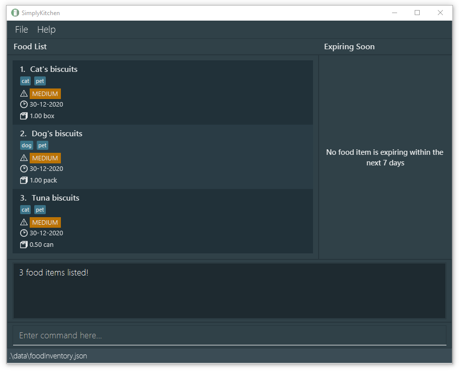

Figure 10: Food list displaying the result of the find command

<a href="https://ay2021s1-cs2103t-f13-4.github.io/tp/UserGuide.html#">^ Back to top</a>

### 5.3.3. Viewing expired food items

When you launch the application, it checks for any expired food items present in your food inventory. This lets you easily see what food items have expired.
If there is any expired food item, a pop-up window similar to the one shown in Figure 11 will appear with the list of expired food item(s).
If you want to see the pop-up window while using the application, you can use the `expired` command.

Figure 11: A pop-up window listing all the expired food items

**:information_source: Updating your food inventory:** 

If you have discarded the expired food item, please remember to delete the associated food item from the application using the [`delete`](#deleting-a-food-item) command.

**Format:** `expired`

<a href="https://ay2021s1-cs2103t-f13-4.github.io/tp/UserGuide.html#">^ Back to top</a>

## 5.4. Miscellaneous commands

These are additional commands you can use to enhance your experience with SimplyKitchen.

### 5.4.1. Undoing previous command

The `undo` command restores your food inventory to a state before an undoable command was executed. This lets you easily correct mistakes made on your food inventory.
Undoable commands are commands that modify your food inventory's content (`add`, `edit`, `delete` , `changeqty` and `clear`) and commands that sort food items (`sortdesc`, `sortexpiry`, `sortpriority`).

**Format:** `undo`

**Examples:**
* `delete 1` followed by `undo` will reverse the `delete` command.
* `delete 1` followed by `clear` then `undo` will reverse the `clear` command.

<a href="https://ay2021s1-cs2103t-f13-4.github.io/tp/UserGuide.html#">^ Back to top</a>

### 5.4.2. Redoing previously undone command

The `redo` command restores your food inventory to a state before an undo command was executed. This lets you easily redo commands that were incorrectly undone.

**Format:** `redo`

**Examples:**
* `add d/Donut p/medium e/21-2-2021` followed by `undo` then `redo` will reverse the state to when the food item was added.
* `clear` followed by `undo` then `redo` will redo the `clear` command.

<a href="https://ay2021s1-cs2103t-f13-4.github.io/tp/UserGuide.html#">^ Back to top</a>

### 5.4.3. Clearing all entries

The `clear` command clears all entries from your food inventory. This lets you easily clear the sample data, or start on a clean food inventory.

**Format:** `clear`

**:exclamation: Warning:** 

Note that the data saved in your hard disk will be cleared when you use this command!

<a href="https://ay2021s1-cs2103t-f13-4.github.io/tp/UserGuide.html#">^ Back to top</a>

### 5.4.4. Viewing help

The `help` command shows a help message explaining how to access the user guide.
After entering this command, you should see a pop-up window similar to the one shown in Figure 12.

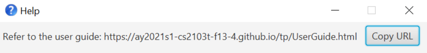

Figure 12: A pop-up window displaying the URL to the User Guide

**Format:** `help`

<a href="https://ay2021s1-cs2103t-f13-4.github.io/tp/UserGuide.html#">^ Back to top</a>

### 5.4.5. Exiting the program

The `exit` command closes the application. This lets you easily exit the application from the CLI.

**Format:** `exit`

<a href="https://ay2021s1-cs2103t-f13-4.github.io/tp/UserGuide.html#">^ Back to top</a>

## 5.5. Saving the data

Your food inventory data is saved in the hard disk automatically after any command that changes the data. There is no need to save manually.

<a href="https://ay2021s1-cs2103t-f13-4.github.io/tp/UserGuide.html#">^ Back to top</a>

--------------------------------------------------------------------------------------------------------------------

# 6. Upcoming features [coming in v2.0]

## 6.1. Storage

### 6.1.1. Adding a storage location for a food item

Allows storage location information to be tracked for a food item, using the `s/` prefix.

### 6.1.2. Moving a food item
 
Moves a food item from one storage location to another storage location.

**Format:** `move s/SOURCE_LOCATION s/DESTINATION_LOCATION`

## 6.2. Sort Command

### 6.2.1. Sorting by descending description

Sorts the list of food items in reverse order to the `sortdesc` command.

### 6.2.2. Checking sorting order

Displays the current sorting order of the food list.

**Format:** `vieworder`

## 6.3. Find Command

### 6.3.1. Finding food items based on partial search fields

Allows for food items to match when their fields match partially to the search field.

**Example:**
* `find d/can` matches food items with descriptions `canned fish` and `cans of beans`.

<a href="https://ay2021s1-cs2103t-f13-4.github.io/tp/UserGuide.html#">^ Back to top</a>

--------------------------------------------------------------------------------------------------------------------

## 7. Frequently asked questions (FAQs)

**Q**: How do I transfer my data to another computer? 
**A**: Install the application in the other computer and overwrite the empty data file it creates with the data file in your previous SimplyKitchen home folder.

**Q**: What are the design and implementation considerations behind SimplyKitchen's code? 
**A**: You may find this information at our [Developer Guide](https://ay2021s1-cs2103t-f13-4.github.io/tp/DeveloperGuide.html).

**Q**: How do I report a bug? 
**A**: You may do so by creating a new issue in our [GitHub Repository](https://github.com/AY2021S1-CS2103T-F13-4/tp/issues).

**Q**: What does SimplyKitchen consider as a duplicate food item? 
**A**: In SimplyKitchen, two food items are duplicates if they have the same `description`, `expiry date` and `tags`. 
* All the tags must be the same.
* The capitalisation of the characters in the description or tag is ignored while checking for duplicates.
* The priority and quantity of food items are not considered while checking for duplicates. 

Figure 13 shows what the application will look like if you try to add a duplicate food item.
In this case, the description, expiry date and tag of the food item to be added is the same as the food item already inside the food inventory.
Therefore, the food item to be added is considered a duplicate.

Figure 13: An error message is displayed in the result box when adding a duplicate food item.

<a href="https://ay2021s1-cs2103t-f13-4.github.io/tp/UserGuide.html#">^ Back to top</a>

--------------------------------------------------------------------------------------------------------------------

## 8. Command summary

Action | Format, Examples
-------|------------------
**Add** | `add d/DESCRIPTION e/EXPIRY_DATE q/QUANTITY [p/PRIORITY] [t/TAG]…`  e.g. `add d/cereal e/31-10-2020 q/2 p/medium t/corn flakes`
**Edit** | `edit INDEX [d/DESCRIPTION] [e/EXPIRY_DATE] [q/QUANTITY] [p/PRIORITY] [t/TAG]...`  e.g. `edit 1 d/baked beans e/1-1-2020 q/1.5 can`
**Delete** | `delete INDEX`  e.g. `delete 3`
**Change quantity** | `changeqty INDEX a/AMOUNT`  e.g. `changeqty 1 a/+1.50`
**Sort by description** | `sortdesc`
**Sort by expiry date** | `sortexpiry`
**Sort by priority** | `sortpriority`
**List** | `list`
**Find** | `find [d/DESCRIPTION [MORE_DESCRIPTIONS]...] [e/EXPIRY DATE] [p/PRIORITY] [t/TAG]...`  e.g. `find d/biscuits e/30-12-2020 p/medium t/cat t/dog`
**View expired food items** | `expired`
**Undo** | `undo`
**Redo** | `redo`
**Clear** | `clear`
**Help** | `help`
**Exit** | `exit`

<a href="https://ay2021s1-cs2103t-f13-4.github.io/tp/UserGuide.html#">^ Back to top</a>

--------------------------------------------------------------------------------------------------------------------

## 9. Glossary

Term | Definition/Description
-----|------------------
**CLI** | Command Line Interface. It is a form of user and computer interaction where the user inputs commands in the form of text. Users will utilise a CLI to input commands into SimplyKitchen.
**Description** | The description of a food item.
**Duplicate Food Item** | A food item is considered a duplicate if its description, expiry date and tags are all the same as another food item in the food inventory.
**Expiring Food Item** | A food item is "expiring" if its expiry date is from today, to 7 days after today. For instance, if today is 7-11-2020, food items that expire from 7-11-2020 to 14-11-2020 are deemed as "expiring".
**Expiry Date** | The expiry date of a food item.
**GUI** | Graphical User Interface. It is a form of user and computer interaction that allows the user to interact via graphical icons such as buttons, scroll bars and windows. SimplyKitchen has a GUI for the user to interact with.
**Lexicographical Order** | It is the order used in dictionaries. However, it has additional requirements. Requirements applicable to SimplyKitchen are, namely, capital letters precedes lower-case letters, apostrophes precedes letters, and spaces precedes both apostrophes and letters.
**Priority** | The priority of a food item. The priority field can either be `high`, `medium` or `low`.
**Quantity** | The quantity of a food item. The quantity consists of 2 entities - `value` and `unit`.
**Tag** | Tags are additional information that can be tagged to food items.

<a href="https://ay2021s1-cs2103t-f13-4.github.io/tp/UserGuide.html#">^ Back to top</a>

--------------------------------------------------------------------------------------------------------------------
