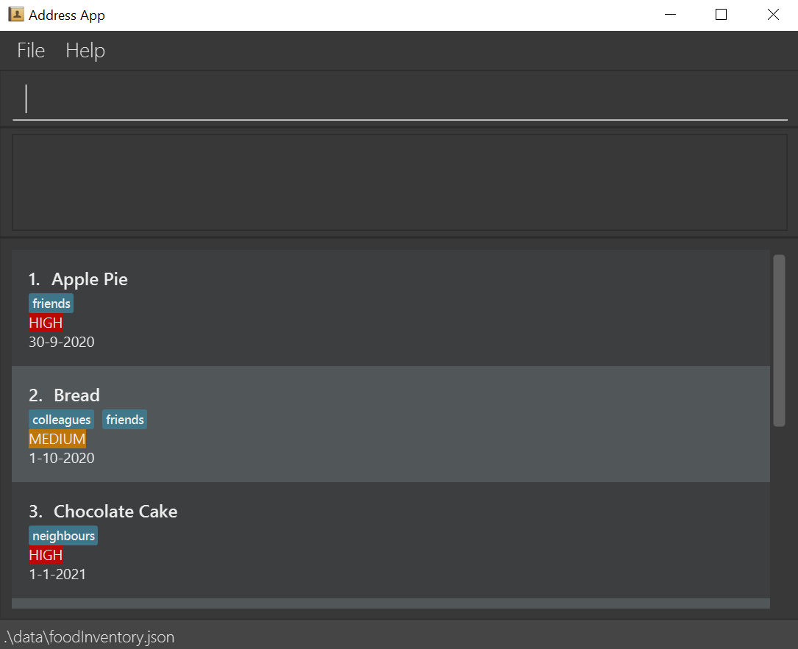
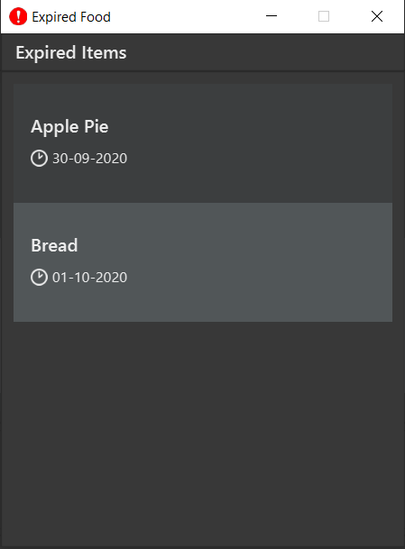
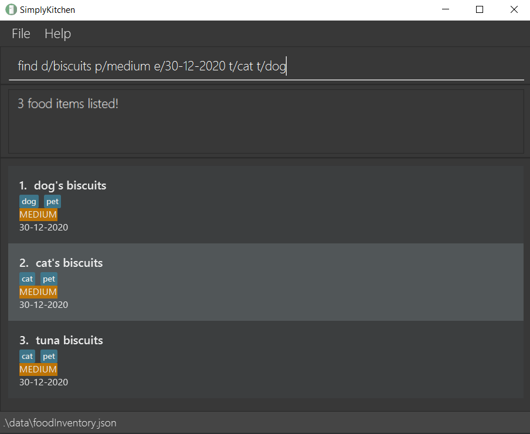
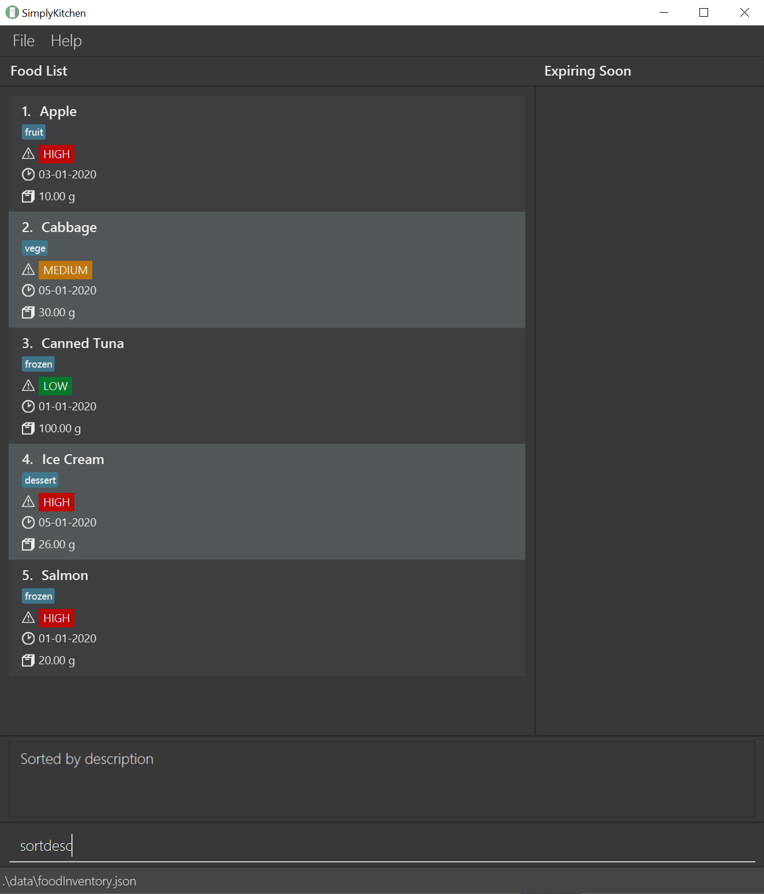
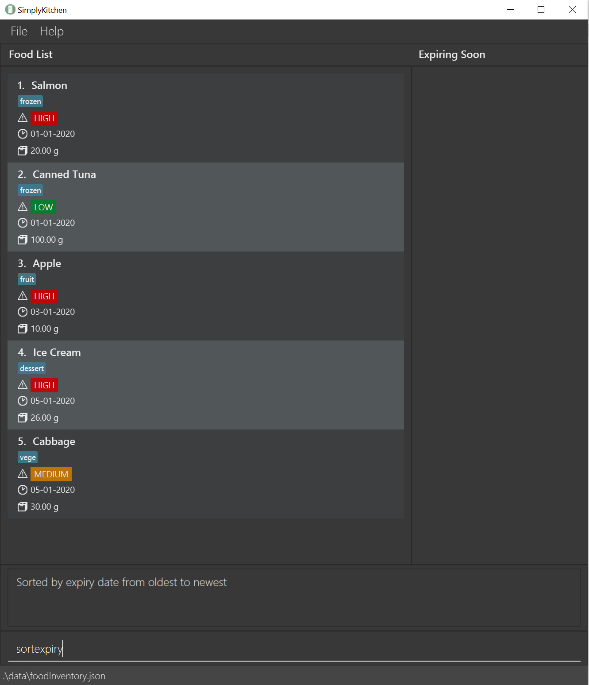
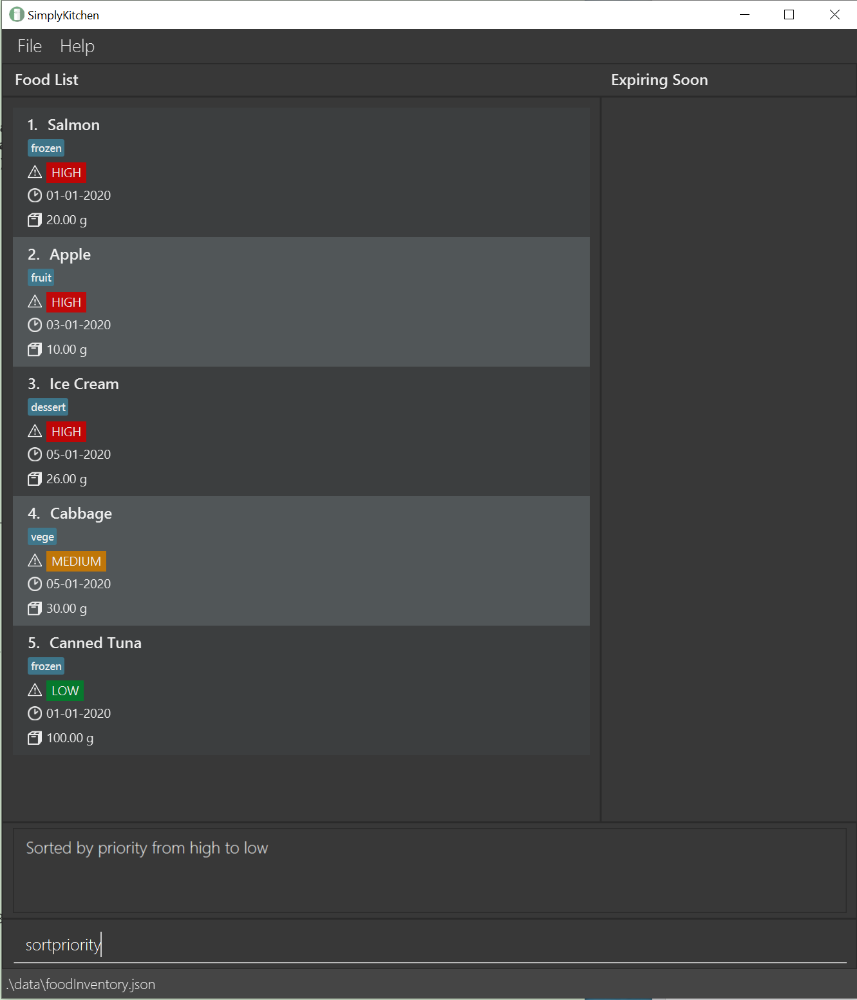

# Table of contents

* [Introduction](#introduction)
* [About this document](#about-this-document)
* [Quick start](#quick-start)
* [Features](#features)
  * [Viewing help](#viewing-help)
  * [Viewing expired food items](#viewing-expired-food-items)
  * [Adding a food item](#adding-a-food-item)
  * [Listing all food items](#listing-all-food-items)
  * [Searching for a food item](#searching-for-a-food-item)
  * [Deleting a food item](#deleting-a-food-item)
  * [Editing a food item](#editing-a-food-item)
  * [Changing the quantity of a food item](#changing-the-quantity-of-a-food-item)
  * [Sort food items by description](#sort-food-items-by-description)
  * [Sort food items by expiry date](#sort-food-items-by-expiry-date)
  * [Sort food items by priority](#sort-food-items-by-priority)
  * [Undoing previous command](#undoing-previous-command)
  * [Redoing previously undone command](#redoing-previously-undone-command)
  * [Clearing all entries](#clearing-all-entries)
  * [Exiting the program](#exiting-the-program)
  * [Saving the data](#saving-the-data)
* [FAQs](#faq)
* [Command summary](#command-summary)

--------------------------------------------------------------------------------------------------------------------

# Introduction

SimplyKitchen is a desktop app for food inventory management, optimised for use via a Command Line Interface (CLI) while still having the benefits of a Graphical User Interface (GUI). 
With intuitive and practical features, it can get your food management tasks done faster and more efficiently than traditional GUI apps.

SimplyKitchen aims to help you, a domestic household member, to manage your kitchen by providing a food inventory management system.
We have taken into consideration the common problems you may face while managing your kitchen and have created specialised features to address them.

Since the app is meant for the general households, care has been taken to make it more intuitive and not overwhelming to facilitate comfortable usage for all.
We hope to make SimplyKitchen a household name in Singapore and appreciate your assistance in helping us do so!

<a href="https://ay2021s1-cs2103t-f13-4.github.io/tp/UserGuide.html">^ Back to top</a>

--------------------------------------------------------------------------------------------------------------------

# About this document

This document is a User Guide meant to assist you in using SimplyKitchen to manage your food inventory.

The [quick start](#quick-start) section guides you in setting up and launching the SimplyKitchen app on your computer.

The [features](#features) section helps you understand and use the features of SimplyKitchen. 
It gives clear examples for each feature to ensure that the purpose and constraints of the feature are evident.

The [FAQs](#faq) section contains some Frequently Asked Questions with regard to SimplyKitchen.

Finally, the [command summary](#command-summary) section acts as a quick reference point for all the features of SimplyKitchen.

<a href="https://ay2021s1-cs2103t-f13-4.github.io/tp/UserGuide.html">^ Back to top</a>

--------------------------------------------------------------------------------------------------------------------

# Quick start

* Ensure that you have Java 11 or above installed on your computer.
* Download the most recent SimplyKitchen.jar file from [this link](https://github.com/AY2021S1-CS2103T-F13-4/tp/releases).
* Copy the downloaded jar file into a folder which will be your home folder for SimplyKitchen.
* Double click on the SimplyKitchen.jar file to launch the app. An app window similar to the one shown below should appear in a few seconds. 

  

* Notice how the app is populated with some sample data.
* Start using the app by typing a command in the command box at the bottom. For example, typing `help` and then pressing enter will open the help window.
* Refer to the [features section in this guide](#features) for help on how to use the app.

<a href="https://ay2021s1-cs2103t-f13-4.github.io/tp/UserGuide.html">^ Back to top</a>

--------------------------------------------------------------------------------------------------------------------

# Features

**:information_source: Notes about the command format:** 

* You have to supply values for parameters in `UPPER_CASE`. 
  e.g. In `add d/DESCRIPTION`, `DESCRIPTION` is a parameter which can be used as `add d/cucumber`.

* Parameters are compulsory unless they are in square brackets. 
  e.g `d/DESCRIPTION e/EXPIRY_DATE [p/PRIORITY]` can be used as `d/bread e/30-09-2020` or as `d/bread e/30-09-2020 p/low`.
  However, it cannot be used as `e/30-09-2020 p/low` because the description is missing.

* Parameters can be in any order. 
  e.g. If the command specifies `d/DESCRIPTION e/EXPIRY_DATE`, `e/EXPIRY_DATE d/DESCRIPTION` is also acceptable.

<a href="https://ay2021s1-cs2103t-f13-4.github.io/tp/UserGuide.html">^ Back to top</a>

## Viewing help

The `help` command shows a help message explaining how to access the user guide.
After entering this command, you should see a pop-up window similar to the one shown below.

**Format:** `help`

<a href="https://ay2021s1-cs2103t-f13-4.github.io/tp/UserGuide.html">^ Back to top</a>

## Viewing expired food items

When you launch the app, it checks for any expired food items present in your food inventory. This lets you easily see what food items have expired.
If there is any expired food item, a pop-up window similar to the one shown below will appear with the list of expired food item(s).
If you have discarded the expired food item, please remember to delete the associated food item from the app using the [`delete`](#deleting-a-food-item) command.

If you want to see the list of expired food items when using the app, you can use the `expired` command.

**Format:** `expired`

<a href="https://ay2021s1-cs2103t-f13-4.github.io/tp/UserGuide.html">^ Back to top</a>

## Adding a food item

The `add` command stores a food item in your food inventory, so that you can start tracking it.
You can then access the food item later on for editing, deleting etc.

**Format:** `add d/DESCRIPTION e/EXPIRY_DATE q/QUANTITY [p/PRIORITY] [t/TAG]…`

* A food item with the same description, expiry date and tags as another food item is considered a duplicate.
* Description and tags are case-insensitive (i.e `d/Apple e/30-12-2020 q/1 t/Red` is the same item as `d/apple e/30-12-2020 q/2 t/red`).
* The quantity field consists of 2 entities - `value` and `unit`. The `value` should come before the `unit`.
  * The `value` is compulsory. It must be a positive number with a maximum of 2 decimal places.
  * The `unit` is optional. If provided, it must consist of only alphabets. Numbers, spaces and special characters are not allowed. If not provided, the default unit - `unit` - will be given.
* The expiry date field only accepts a date in the format of `DD-MM-YYYY` or `DD/MM/YYYY`.
* The priority field can either be `high`, `medium` or `low` and is optional. If a priority is not specified, the default priority will be set to `low`.
* The tag field accepts `alphanumeric`, `whitespaces` and these special characters: `#$%&-()`.
  * Tags with only whitespace(s) are not allowed.
  * A food item can have any number of tags (including 0).

**Examples:**
* `add d/canned tuna e/01-01-2021 q/1.5 can p/low`
* `add d/apple pie e/11-10-2020 q/2 p/medium t/frozen t/$15 t/contains nuts`

<a href="https://ay2021s1-cs2103t-f13-4.github.io/tp/UserGuide.html">^ Back to top</a>

## Listing all food items

The `list` command shows the complete list of food items in your food inventory.
This command is suitable if you want to get a glimpse of all your food items currently in your kitchen.

**Format:** `list`

<a href="https://ay2021s1-cs2103t-f13-4.github.io/tp/UserGuide.html">^ Back to top</a>

## Searching for a food item

The `find` command searches for food items in your food inventory and displays the result on your food list. You can easily find a specific food item, or a group of food items.
The search will return food items with matching description, priority, expiry date and tags (i.e `[d/DESCRIPTION OR [MORE_DESCRIPTIONS]...] AND [p/PRIORITY] AND [e/EXPIRY DATE] AND [t/TAG] OR ...`).

**Format:** `find [d/DESCRIPTION [MORE_DESCRIPTIONS]...] [e/EXPIRY DATE] [p/PRIORITY] [t/TAG]...`

* You must specify at least one parameter for this command to be valid.
* The search is case-insensitive. e.g `fish` will match `Fish`.
* The order of the descriptions does not matter. e.g. `Cake Fish` will match `Fish Cake`.
* Only full words in description will be matched. e.g. `fis` will not match `fish`.
* Food items with description matching at least one keyword will be returned (i.e `OR` search). e.g. `fish` will return `Fish Cake`, `Tuna Fish`.
* The expiry date field only accepts a date in the format of `DD-MM-YYYY` or `DD/MM/YYYY`.
* The priority field can either be `high`, `medium` or `low`.
* The tag field accepts `alphanumeric`, `whitespaces` and these special characters: `#$%&-()`.
  * Tags with only whitespace(s) are not allowed.
  * Only full tags will be matched e.g. `nuts` will not match `contains nuts`.
  * Food items with tags matching at least one of the search tags will be returned (i.e `OR` search). e.g. `frozen` will return all food items with tags `frozen` regardless of their other tags.

**Examples:**
* `find d/chocolate` returns `Chocolate Pie` and `Chocolate Cake`.
* `find d/apple tuna` returns `Apple Pie` and `Tuna Can`.
* `find e/30-12-2020` returns all food items with expiry date on `30-12-2020`.
* `find d/apple p/high` returns `Apple Pie` and `Apple Jam`, both items have `HIGH` priority.
* `find t/cat t/dog` returns all food items with the tag `cat` or `dog`.
* `find d/biscuits p/medium e/30-12-2020 t/cat t/dog` returns food items with `biscuits` in the description, `MEDIUM` priority, expires on `30-12-2020` and have either `cat` or `dog` as tags.
  
  

<a href="https://ay2021s1-cs2103t-f13-4.github.io/tp/UserGuide.html">^ Back to top</a>

## Deleting a food item

The `delete` command deletes a specified food item from your food inventory, so that you can stop tracking it.

**Format:** `delete INDEX`

* It deletes the food item at the specified `INDEX`.
  * The index refers to the index number shown in the displayed food list.
  * The index **must be a positive integer** 1, 2, 3, …

**Examples:**
* `list` followed by `delete 2` deletes the 2nd food item in your food inventory.
* `find tuna` followed by `delete 1` deletes the 1st food item from the result of the `find` command.

<a href="https://ay2021s1-cs2103t-f13-4.github.io/tp/UserGuide.html">^ Back to top</a>

## Editing a food item

The edit command edits the details of an existing food item in your food inventory. If an entry is incorrect, you can easily edit the entry, without deleting and re-adding the food item.

**Format:** `edit INDEX [d/DESCRIPTION] [p/PRIORITY] [q/QUANTITY] [e/EXPIRY DATE] [t/TAG]...`

* It edits the food item at the specified `INDEX`.
  * The index refers to the index number shown in the displayed food list.
  * The index **must be a positive integer** 1, 2, 3, …
* You must specify at least one parameter (other than the `INDEX`) for this command to be valid.
* Existing values will be replaced with the values you input.
* When editing tags, the existing tags of the food item will be removed i.e adding of tags is not cumulative.
  * You can remove all the tags of a food item by typing `t/` without specifying any tags after it.
* Similar to the [`add`](#adding-a-food-item) command, a food item with the same description, expiry date and tags as another food item is considered a duplicate.

**Examples:**
* `edit 1 d/baked beans e/1-1-2020` edits the food description and expiry date of the 1st food item to be `baked beans` and `1-1-2020` respectively.
* `edit 2 d/canned tuna q/0.5 can t/` edits the food description of the 2nd food item to be `canned tuna`, quantity to `0.5 can` and clears all existing tags.

<a href="https://ay2021s1-cs2103t-f13-4.github.io/tp/UserGuide.html">^ Back to top</a>

## Changing the quantity of a food item

The `changeqty` command changes the quantity of an existing food item in your food inventory. This lets you easily update the current quantity of a food item if you used or stocked up on it.
Use this command if you have bought new food items or used/discarded some existing food items.

**Format:** `changeqty INDEX a/AMOUNT`

* The index refers to the index number shown in the displayed food list.
  * The index **must be a positive integer** 1, 2, 3, …
* The amount is the quantity of a food item you want to change by. It is compulsory and can be any non-zero signed number.
  * Choose an amount such that the final quantity is not less than or equal to zero.
  * The amount can be specified up to a maximum of 2 decimal places.
* Do not specify the unit of the food item. The existing unit will be used instead.

**Examples:**
* `changeqty 1 a/+1` increases the quantity of the 1st food item by 1.
* `changeqty 2 a/-2` decreases the quantity of the 2nd food item by 2.

<a href="https://ay2021s1-cs2103t-f13-4.github.io/tp/UserGuide.html">^ Back to top</a>

## Sort food items by description

The `sortdesc` command sorts the list of food items by description. This function is useful if you forget a food item's exact spelling, and you are unable to use the `find` command for it.

**Format:** `sortdesc`

* Sorting by description consists of first sorting lexicographically, then by the descriptions' first characters.
* If the first characters are the same letters, descriptions with upper case first characters will be ordered lower than descriptions with lower case first characters. 
* Food items of the same description will be sorted by expiry date from oldest to newest.
* Food items of the same description and same expiry date will be sorted by priority from high to low.

**Examples:**
* A possible valid ordering of descriptions would be: "apple", "apricot", "Acorn"

<a href="https://ay2021s1-cs2103t-f13-4.github.io/tp/UserGuide.html">^ Back to top</a>

## Sort food items by expiry date

The `sortexpiry` command sorts the list of food items by expiry date from oldest to newest. With this, you can easily tell which food items are expiring first.

**Format:** `sortexpiry`

* Food items of the same expiry date will be sorted by priority from high to low.
* Food items of the same expiry date and same priority will be sorted by description.

<a href="https://ay2021s1-cs2103t-f13-4.github.io/tp/UserGuide.html">^ Back to top</a>

## Sort food items by priority

The `sortpriority` command sorts the list of food items by priority from high to low. With this, you can easily tell which food items have higher priority.

**Format:** `sortpriority`

* If two food items have the same priority, they will be ordered by expiry date from oldest to newest.
* If two food items have the same priority and expiry date, they will be ordered by description.

<a href="https://ay2021s1-cs2103t-f13-4.github.io/tp/UserGuide.html">^ Back to top</a>

## Undoing previous command

The `undo` command restores your food inventory to a state before an undoable command was executed. This lets you easily correct mistakes made on your food inventory.
Undoable commands are commands that modify your food inventory's content (`add`, `delete`, `edit` and `clear`)

**Format:** `undo`

**Examples:**
* `delete 1` then `undo` will reverse the delete command.
* `delete 1` `clear` then `undo` will reverse the `clear` command.

<a href="https://ay2021s1-cs2103t-f13-4.github.io/tp/UserGuide.html">^ Back to top</a>

## Redoing previously undone command

The `redo` command restores your food inventory to a state before an undo command was executed. This lets you easily redo commands that were incorrectly undone.

**Format:** `redo`

**Examples:**
* `add d/Donut p/medium e/21-2-2021` `undo` then `redo` will reverse the state to when the food item was added.
* `clear` `undo` then `redo` will redo the `clear` command.

## Clearing all entries

The `clear` command clears all entries from your food inventory. This lets you easily clear the starting data, or start on a clean food inventory.
Note that the data saved in your hard disk will also be cleared!

**Format:** `clear`

<a href="https://ay2021s1-cs2103t-f13-4.github.io/tp/UserGuide.html">^ Back to top</a>

## Exiting the program

The `exit` command closes the app.

**Format:** `exit`

<a href="https://ay2021s1-cs2103t-f13-4.github.io/tp/UserGuide.html">^ Back to top</a>

## Saving the data

Your food inventory data is saved in the hard disk automatically after any command that changes the data. There is no need to save manually.

<a href="https://ay2021s1-cs2103t-f13-4.github.io/tp/UserGuide.html">^ Back to top</a>

--------------------------------------------------------------------------------------------------------------------

## FAQ

**Q**: How do I transfer my data to another Computer? 
**A**: Install the app in the other computer and overwrite the empty data file it creates with the file that contains the data of your previous SimplyKitchen home folder.

**Q**: What are the design and implementation considerations behind SimplyKitchen's code? 
**A**: You may find this information at our [Developer Guide](https://ay2021s1-cs2103t-f13-4.github.io/tp/DeveloperGuide.html).

**Q**: How do I report a bug? 
**A**: You may do so by creating a new issue in our [GitHub Repository](https://github.com/AY2021S1-CS2103T-F13-4/tp/issues).

<a href="https://ay2021s1-cs2103t-f13-4.github.io/tp/UserGuide.html">^ Back to top</a>

--------------------------------------------------------------------------------------------------------------------

## Command summary

Action | Format, Examples
--------|------------------
**Help** | `help`
**View expired** | `expired`
**Add** | `add d/DESCRIPTION e/EXPIRY_DATE q/QUANTITY [p/PRIORITY] [t/TAG]…`   e.g., `add d/cereal e/31-10-2020 q/2 p/medium t/corn flakes`
**List** | `list`
**Find** | `find [d/DESCRIPTION [MORE_DESCRIPTIONS]...] [p/PRIORITY] [e/EXPIRY DATE] [t/TAG]...`  e.g., `find d/biscuits p/medium e/30-12-2020 t/cat t/dog`
**Delete** | `delete INDEX`  e.g., `delete 3`
**Edit** | `edit INDEX [d/DESCRIPTION] [p/PRIORITY] [q/QUANTITY] [e/EXPIRY DATE] [t/TAG]…`   e.g., `edit 1 d/baked beans e/1-1-2020 q/1.5 can`
**Change quantity** | `changeqty INDEX a/AMOUNT`   e.g. `changeqty 1 a/+1.50`
**Sort by Description** | `sortdesc`
**Sort by Expiry Date** | `sortexpiry`
**Sort by Priority** | `sortpriority`
**Undo** | `undo`
**Redo** | `redo`
**Clear** | `clear`
**Exit** | `exit`

<a href="https://ay2021s1-cs2103t-f13-4.github.io/tp/UserGuide.html">^ Back to top</a>

--------------------------------------------------------------------------------------------------------------------
