# Table of contents
_(Contributed by all members)_
* [1. Introduction](#1-introduction)
* [2. About this document](#2-about-this-document)
    *[2.1. Main sections](#21-main-sections)
    *[2.2. Symbols](#22-symbols)
* [3. Quick start](#3-quick-start)
* [4. Application layout](#4-application-layout)
* [5. Features](#5-features)
  * [5.1. Basic commands](#51-basic-commands)
    * [5.1.1. Adding a food item: `add`](#511-adding-a-food-item-add)
    * [5.1.2. Editing a food item: `edit`](#512-editing-a-food-item-edit)
    * [5.1.3. Deleting a food item: `delete`](#513-deleting-a-food-item-delete)
    * [5.1.4. Changing the quantity of a food item: `changeqty`](#514-changing-the-quantity-of-a-food-item-changeqty)
  * [5.2. Sorting commands](#52-sorting-commands)  
    * [5.2.1. Sorting food items by description: `sortdesc`](#521-sorting-food-items-by-description-sortdesc)
    * [5.2.2. Sorting food items by expiry date: `sortexpiry`](#522-sorting-food-items-by-expiry-date-sortexpiry)
    * [5.2.3. Sorting food items by priority: `sortpriority`](#523-sorting-food-items-by-priority-sortpriority)
  * [5.3. Viewing commands](#53-viewing-commands)    
    * [5.3.1. Listing all food items: `list`](#531-listing-all-food-items-list)
    * [5.3.2. Finding food items: `find`](#532-finding-food-items-find)
    * [5.3.3. Viewing expired food items: `expired`](#533-viewing-expired-food-items-expired)
  * [5.4. Miscellaneous commands](#54-miscellaneous-commands)
    * [5.4.1. Undoing previous command: `undo`](#541-undoing-previous-command-undo)
    * [5.4.2. Redoing previously undone command: `redo`](#542-redoing-previously-undone-command-redo)     
    * [5.4.3. Clearing all entries: `clear`](#543-clearing-all-entries-clear)
    * [5.4.4. Viewing help: `help`](#544-viewing-help-help)
    * [5.4.5. Exiting the program: `exit`](#545-exiting-the-program-exit)
  * [5.5. Saving the data](#55-saving-the-data)
* [6. Frequently asked questions (FAQs)](#6-frequently-asked-questions-faqs)
* [7. Command summary](#7-command-summary)
* [8. Glossary](#8-glossary)

 

# 1. Introduction
_(Contributed by all members)_

Welcome to SimplyKitchen! :cake:

SimplyKitchen is a desktop application for food inventory management suited for **household individuals who manage their kitchens' food items**.

SimplyKitchen is developed by 5 dedicated students who hope to assist and alleviate the problems you might encounter while managing your food inventory.
With intuitive and practical features, SimplyKitchen can get your food management tasks done **faster and more efficiently**!

With a Command Line Interface (CLI), SimplyKitchen is best suited to those who can type fast and prefer using a keyboard.
SimplyKitchen also uses a Graphical User Interface (GUI) to provide an aesthetic visualization of your food information for the ideal user experience.

SimplyKitchen hopes to empower you to work towards a **Tidy Kitchen, with Tiny Wastage**!

[Back to top](#table-of-contents)

--------------------------------------------------------------------------------------------------------------------

# 2. About this document
_(Contributed by all members)_

## 2.1. Main sections

This purpose of this User Guide is to provide you all the information you need when using our application in a clear and concise manner.
Our User Guide is structured in a way to help you navigate to relevant sections easily. You may click on the hyperlinks to 
quickly jump to different sections of this document.

The [Quick Start](#3-quick-start) section guides you in **setting up and launching** the SimplyKitchen application on your computer.

The [Application Layout](#4-application-layout) section provides an overview of how the application looks like on your computer.

The [Features](#5-features) section describes all the features of SimplyKitchen.
It provides the **purpose**, **command format**, **command conditions** and **step-by-step examples** for each feature.

The [FAQs](#6-frequently-asked-questions-faqs) section contains some **Frequently Asked Questions** about SimplyKitchen.

The [Command Summary](#7-command-summary) section acts as a quick reference point for all the features of SimplyKitchen.

Finally, the [Glossary](#8-glossary) section provides explanations for the commonly used terms in this document and in th SimplyKitchen application.

[Back to top](#table-of-contents)

## 2.2. Symbols 

The table below provides the descriptions of the symbols used in this document:

| Symbol |  Description |
|----------|-------------|
|
 :information_source: 
  | - Notes about command format - Additional information that may be relevant to you |
|
 :warning: 
 | - Warning: Information you should pay particular attention about  |
|
 :bulb: 
 | - Tip: Information that may be helpful to you |

[Back to top](#table-of-contents)

--------------------------------------------------------------------------------------------------------------------

# 3. Quick start
_(Contributed by Sagar Sureka)_

This section will guide you in setting up and launching SimplyKitchen on your computer.

* Ensure that you have `Java 11` or above installed on your computer.
* Download the most recent `SimplyKitchen.jar` file from [this link](https://github.com/AY2021S1-CS2103T-F13-4/tp/releases).
* Copy the downloaded jar file into a folder which will be your _home folder_ for SimplyKitchen.
* Double click on the `SimplyKitchen.jar` file to launch the app. The SimplyKitchen main window, similar to the one shown in Figure 1, should appear in a few seconds.

  
  
  
Figure 1: SimplyKitchen main window

**:information_source: Problems launching the app?** 

In case the application does not start after you double-click on the `SimplyKitchen.jar` file, try doing the following based on your computer's Operating System:

_For Mac OS users:_

* Launch the terminal and navigate to your SimplyKitchen _home folder_, or right-click on the folder and click on _New Terminal at Folder_.
* Enter `java -jar SimplyKitchen.jar` into the terminal.

_For Windows users:_

* Launch the command prompt and navigate to your SimplyKitchen _home folder_.
* Enter `java -jar SimplyKitchen.jar` into the command prompt.

**SimplyKitchen should launch a few seconds after you have entered the command.**

* Notice how the application is populated with some sample data. Some food items from the sample data are expired and displayed in a separate pop-up window as shown in Figure 2.
 
  

  
Figure 2: The SimplyKitchen pop-up window displays all the expired food items.

* Start using the application by typing a command in the command box at the bottom. For example, typing `help` and then pressing `Enter` will open the help window.
* Refer to the [Features](#5-features) section in this guide for help on how to use the app.

[Back to top](#table-of-contents)

--------------------------------------------------------------------------------------------------------------------

# 4. Application layout
_(Contributed by Roland Yu)_

This section provides an introduction to SimplyKitchen's Graphical User Interface (GUI) layout. 

Figure 3 details the main components:

  

Figure 3: Main components of SimplyKitchen

The table below provides the descriptions of the main components:

Component           | Description
--------------------|-----------------------------------------------------------------------------------------
Menu Bar            | A top bar with relevant accessible tabs for you to click on
Food List           | A list of your food items
Expiring Food List  | A list of your expiring food items
Expired Food Window | A pop-up window containing a list of your expired food items
Result Box          | A panel which displays the response messages relevant to you while using the application
Command Box         | A text field for you to type your commands
 
Figure 4 provides a breakdown of the food item components displayed in the food list:

Figure 4: Components of a food item

The table below provides the descriptions of the displayed food item components:

Component   | Description
------------|-------------------------------------------------------------
Description | The description of a food item
Tag         | A tag to a food item. Tags are additional information that can be tagged to a food item. (e.g. `spicy`, `for family`, `vegan`)
Priority    | The priority of a food item (i.e. `high`, `medium` or `low`)
Expiry Date | The expiry date of a food item
Quantity    | The quantity of a food item. The quantity consists of 2 entities - `value` and `unit`. (e.g. `1 loaf`, `3.5 g`)
  
[Back to top](#table-of-contents)

--------------------------------------------------------------------------------------------------------------------

# 5. Features
_(Contributed by Jonah Tan)_

This section contains information on the features and commands of SimplyKitchen.

**:information_source: Notes about the command format:** 

* Items with the format `lower_case/` refer to prefixes. They denote the different parameters. 
  The table below provides the descriptions of the relevant prefixes.
 
  Prefix | Description
  -------|-----------------------------------
  `a/`   | Amount of a food item to change by
  `d/`   | Description of a food item
  `e/`   | Expiry date of a food item
  `p/`   | Priority of a food item
  `q/`   | Quantity of a food item
  `t/`   | Tag to a food item

* Words in `UPPER_CASE` refer to information you have to provide. 
  e.g. In `add d/DESCRIPTION`, `DESCRIPTION` refers to the food description you are adding, such as `add d/cucumber`.

* Items in square brackets are optional. 
  e.g `d/DESCRIPTION e/EXPIRY_DATE [p/PRIORITY]` can be used as `d/bread e/30-09-2020` or as `d/bread e/30-09-2020 p/low`.

* Parameters can be in any order. 
  e.g. If the command specifies `p/PRIORITY q/QUANTITY`, `q/QUANTITY p/PRIORITY` is accepted.

* Ellipsis after a parameter indicates that multiple entries of that parameter can be given. 
  e.g. In `[t/TAG]...`, the command can have zero or more tags, such as `t/spicy t/dog`.

[Back to top](#table-of-contents)

## 5.1. Basic commands

The commands in this section are the basic commands used to manipulate food items.

### 5.1.1. Adding a food item: `add`
_(Contributed by Jonah Tan)_

The `add` command stores a food item in your food inventory, so that you can start tracking it.
You can then access the food item later on for editing, deleting etc.

**Format:** `add d/DESCRIPTION e/EXPIRY_DATE q/QUANTITY [p/PRIORITY] [t/TAG]...`

* Duplicates cannot be added to the food inventory. (Please head to the [glossary](#8-glossary) for an explanation for duplicate food items.)
* The description and tag can contain a maximum of 50 and 30 characters respectively, including whitespaces.
* The expiry date must be in the format of `DD-MM-YYYY` or `DD/MM/YYYY`.
* The quantity consists of 2 entities - `value` and `unit`. The `value` should come before the `unit`.
  * The `value` is compulsory. The maximum value allowed is 100,000.00.
  * The `unit` is optional. If not provided, the default unit - `unit` - will be given.
* The priority parameter is case insensitive, and can either be `high`, `medium` or `low` and is optional. If a priority is not specified, the default priority will be set to `LOW`.
* A food item can have any number of tags (including 0).
  * If multiple of the same tags are entered, only the first tag will be added (i.e For `t/Frozen t/frozen t/FROZEN`, only `Frozen` will be added to the food item).

**Examples:**
* `add d/Canned tuna e/1-1-2021 q/1.5 can p/low` adds an item having description `Canned tuna`, expiry date `01-01-2021`, quantity `1.50 can` and priority `LOW`.
* `add d/Banana pie e/20-11-2020 q/2 p/medium t/$15 t/contains nuts` adds an item having description `Banana pie`, expiry date `20-11-2020`, quantity `2.00 unit`, priority `MEDIUM`, and tags `$15` and `contains nuts`.

Steps:
1. Type `add d/Banana pie e/20-11-2020 q/2 p/medium t/$15 t/contains nuts` in the _Command Box_.
2. Press `Enter` to execute.

Before the `add` command is executed:

Figure 5: The red box shows the add command being typed into the command box.

After the `add` command is executed:

Figure 6: The red box shows the new food item being added to the food list.

[Back to top](#table-of-contents)

### 5.1.2. Editing a food item: `edit`
_(Contributed by Roland Yu)_

The `edit` command edits the details of an existing food item in your food inventory.
If an entry is incorrect, you can easily edit the entry without deleting and re-adding the food item.

**Format:** `edit INDEX [d/DESCRIPTION] [e/EXPIRY_DATE] [q/QUANTITY] [p/PRIORITY] [t/TAG]...`

* It edits the food item at the specified `INDEX`.
  * The index refers to the index number shown in the displayed food list.
  * The index **must be a positive integer** 1, 2, 3, …
* Existing values will be replaced with the values you input.
* When editing tags, the existing tags of the food item will be removed i.e adding of tags is not cumulative.
  * You can remove all the tags of a food item by typing `t/` without specifying any tags after it.
* You cannot edit a food item into a duplicate. (Please head to the [glossary](#8-glossary) for an explanation for duplicate food items.)

**:information_source: Note about the parameters:** 

The constraints for the individual parameters of this command (description, expiry date, quantity, priority and tags) are the same as those for the [`add`](#511-adding-a-food-item-add) command.

**Examples:**
* `edit 1 d/baked beans e/1-1-2020` edits the food description and expiry date of the 1st food item to be `baked beans` and `01-01-2020` respectively.
* `edit 2 d/canned tuna q/0.5 can t/` edits the food description of the 2nd food item to be `canned tuna`, quantity to `0.50 can` and clears all existing tags.

Steps:
1. Type `edit 2 p/high e/25-11-2020` in the _Command Box_.
2. Press `Enter` to execute.

Before the `edit` command is executed:

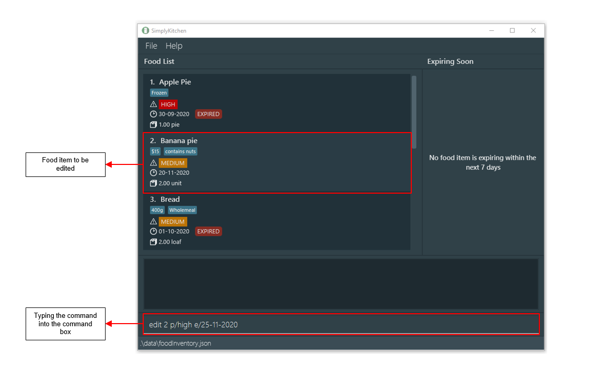

Figure 7: Shows the food item to be edited.

After the command is executed:

Figure 8: Shows the food item after being edited.

[Back to top](#table-of-contents)

### 5.1.3. Deleting a food item: `delete`

_(Contributed by Ang Song Yi and Boh Cheng Hin)_

The `delete` command deletes a specified food item from your food inventory, so that you can stop tracking it.

**Format:** `delete INDEX`

* It deletes the food item at the specified `INDEX`.
  * The index refers to the index number shown in the displayed food list.
  * The index **must be a positive integer** 1, 2, 3, …

**Examples:**
* `list` followed by `delete 2` deletes the 2nd food item in your food inventory.
* `find d/tuna` followed by `delete 1` deletes the 1st food item from the result of the `find` command.

Steps:
1. Type `delete 2` in the _Command Box_.
2. Press `Enter` to execute.

Before the `delete` command is executed:

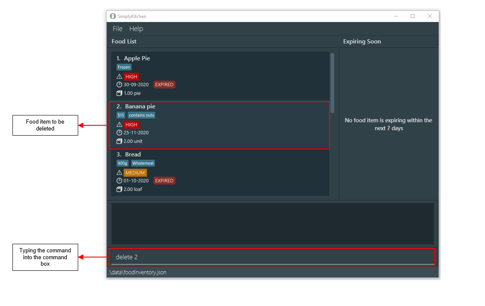

Figure 9: Shows the food item to be deleted

After the `delete` command is executed:

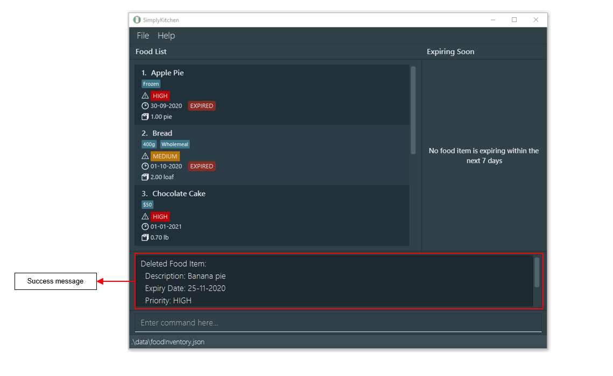

Figure 10: The red box shows the message after the food item is deleted.

[Back to top](#table-of-contents)

### 5.1.4. Changing the quantity of a food item: `changeqty`

_(Contributed by Ang Song Yi)_

The `changeqty` command changes the quantity of an existing food item in your food inventory without you having to calculate it yourself.
Use this command if you have bought new food items or used/discarded some existing food items.

**Format:** `changeqty INDEX a/AMOUNT`

* It changes the quantity of the food item at the specified `INDEX`.
  * The index refers to the index number shown in the displayed food list.
  * The index **must be a positive integer** 1, 2, 3, …
* The amount is the quantity of a food item you want to change by.
  * The amount is a non-zero signed number with a maximum of 2 decimal places. It should be more than -100,000.00 and less than +100,000.00, but not 0.
  * Indicate a positive or negative sign before the value to show increment or decrement respectively.
* Do not specify the unit of the food item. The existing unit will be used instead.

**:information_source: Constraint on the size of amount:** 

Choose an amount such that the **final** quantity of the food item is not less than or equal to 0, or more than 100,000.00.

For example, you have already added 50,000.00 grams of flour in your food inventory with the [`add`](#511-adding-a-food-item-add) command.
You can use the `changeqty` command to add 0.01 to 50,000.00 grams of flour or subtract 0.01 to 49,999.99 grams of flour.
If you have used up all the flour, use the [`delete`](#513-deleting-a-food-item-delete) command instead.

**Examples:**
* `list` followed by `changeqty 1 a/+1` increases the quantity of the 1st food item in your food inventory by 1.
* `find d/tuna` followed by `changeqty 2 a/-2.50` decreases the quantity of the 2nd food item from the result of the `find` command by 2.50.

Steps:
1. Type `changeqty 3 a/-0.5` in the _Command Box_.
2. Press `Enter` to execute.

Before the `changeqty` command is executed:

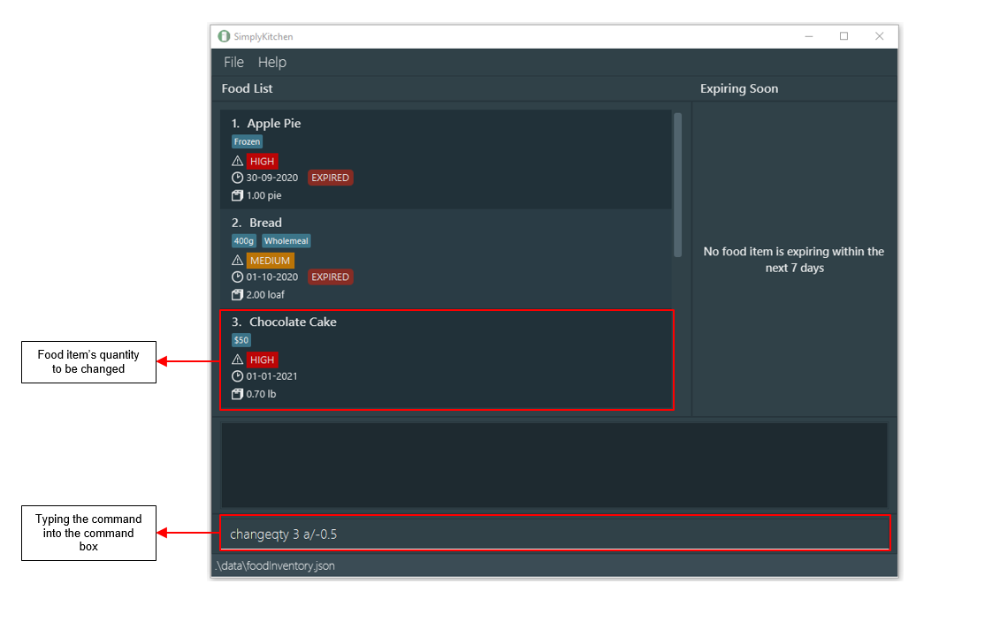

Figure 11: Shows the food item's quantity to be changed.

After the `changeqty` command is executed:

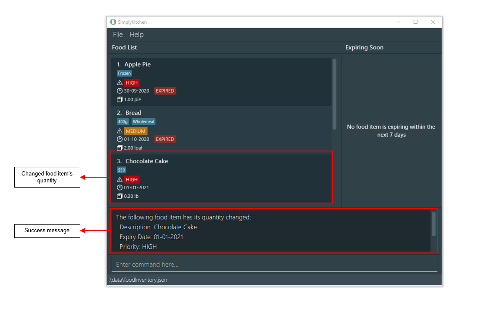

Figure 12: Shows the food item with quantity updated.

[Back to top](#table-of-contents)

## 5.2. Sorting commands
_(Contributed by Roland Yu)_

The commands in this section can be used to sort the food list. The sorting order will remain when restarting the application. 

Before the list of food items is sorted for the first time, it will be ordered by `description` by default. 

Refer to the [Sorting food items by description`](#521-sorting-food-items-by-description-sortdesc) section for a detailed explanation of sorting by description.

### 5.2.1. Sorting food items by description: `sortdesc`
_(Contributed by Roland Yu)_

The `sortdesc` command sorts the list of food items by description, allowing you to view your food items by description.

**Format:** `sortdesc`

* Sorting by description consists of 2 steps:
    * Firstly, the list is sorted in lexicographical order and is case insensitive to the descriptions' first characters.
    * Next, if the first characters of two food items' descriptions are the same letters (e.g. `apple` and `Acorn`), descriptions with upper case first characters will be ordered lower compared to descriptions with lower case first characters (i.e. `Acorn` will be ordered below `apple`).
* Food items of the same description will be sorted by expiry date from oldest to newest.
* Food items of the same description and same expiry date will be sorted by priority from high to low.

Steps:
1. Type `sortdesc` in the _Command Box_.
2. Press `Enter` to execute.

Before the `sortdesc` command is executed:

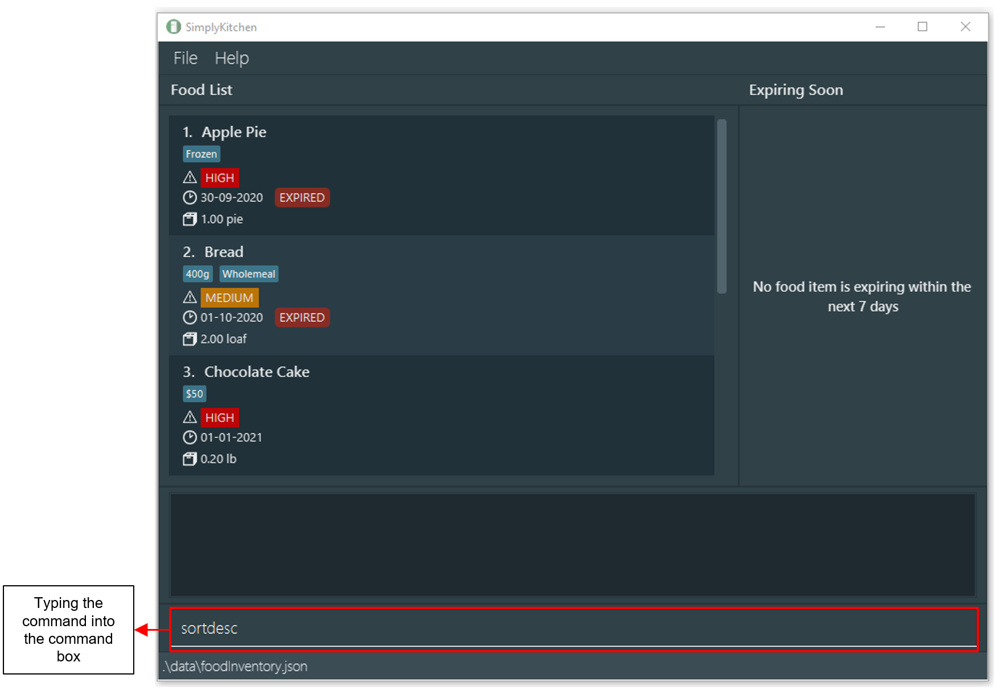

Figure 13: The red box shows the sort by description command being typed into the command box.

After the `sortdesc` command is executed:

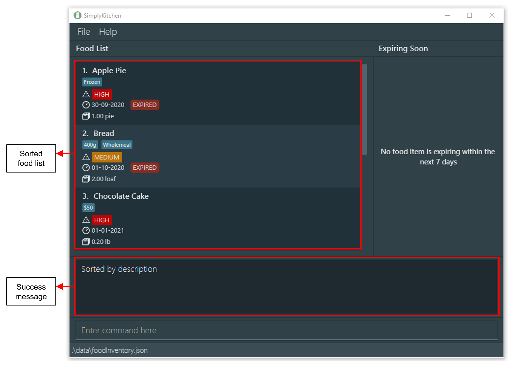

Figure 14: Shows the message displayed after sorting by description.

[Back to top](#table-of-contents)

### 5.2.2. Sorting food items by expiry date: `sortexpiry`
_(Contributed by Roland Yu)_

The `sortexpiry` command sorts the list of food items by expiry date from oldest to newest. With this, you can easily tell which food items are expiring first.

**Format:** `sortexpiry`

* Food items of the same expiry date will be sorted by priority from high to low.
* Food items of the same expiry date and same priority will be sorted by description.

Steps:
1. Type `sortexpiry` in the _Command Box_.
2. Press `Enter` to execute.

Before the `sortexpiry` command is executed:

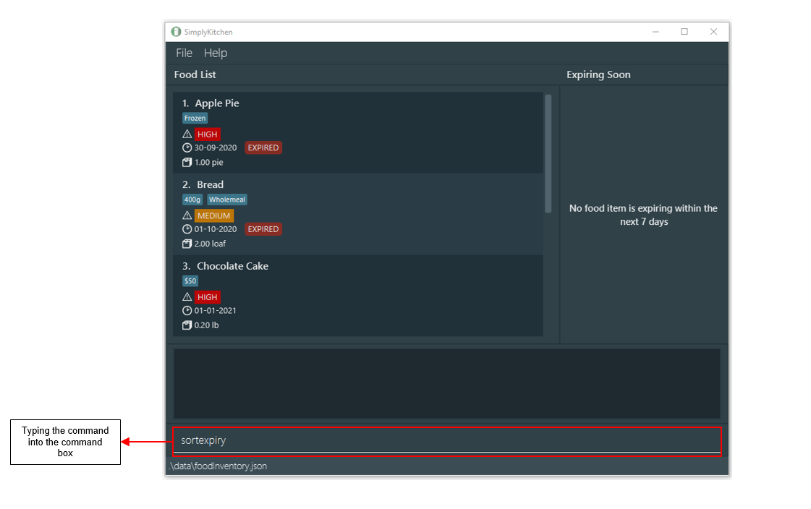

Figure 15: The red box shows the sort by expiry date command being typed into the command box.

After the `sortexpiry` command is executed:

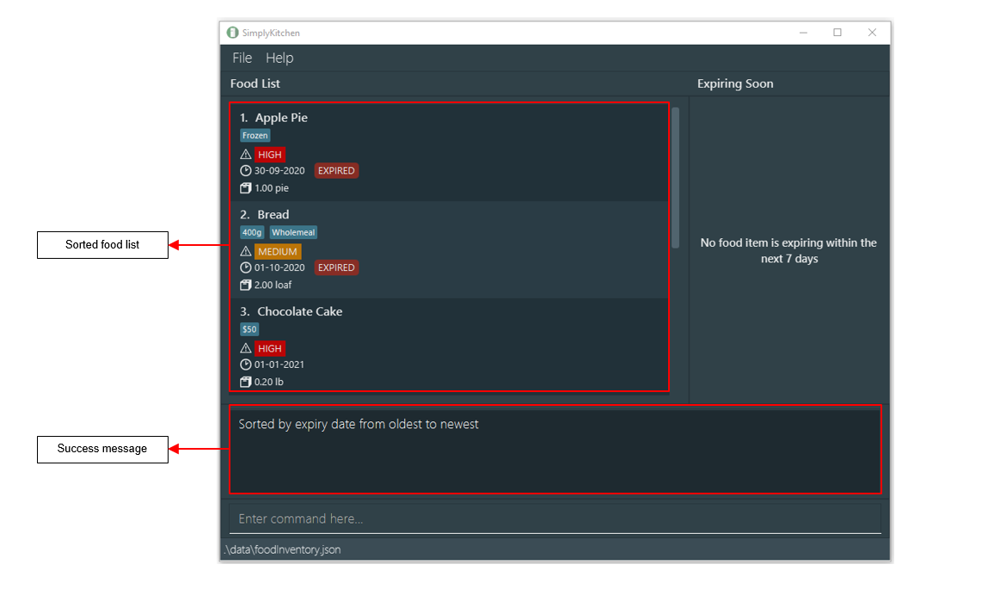

Figure 16: Shows the message displayed after sorting by expiry date

[Back to top](#table-of-contents)

### 5.2.3. Sorting food items by priority: `sortpriority`
_(Contributed by Roland Yu)_

The `sortpriority` command sorts the list of food items by priority from high to low. With this, you can easily tell which food items have higher priorities.

**Format:** `sortpriority`

* Food items of the same priority will be sorted by expiry date from oldest to newest.
* Food items of the same priority and same expiry date will be sorted by description.

Steps:
1. Type `sortpriority` in the _Command Box_.
2. Press `Enter` to execute.

Before the `sortpriority` command is executed:

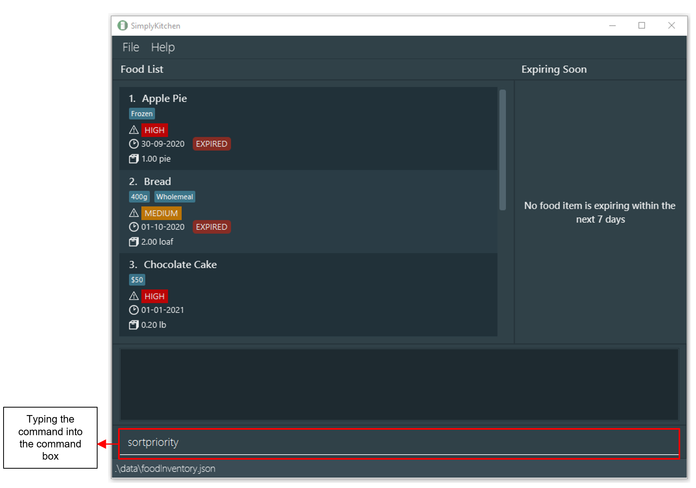

Figure 17: The red box shows the sort by priority command being typed into the command box.

After the `sortpriority` command is executed:

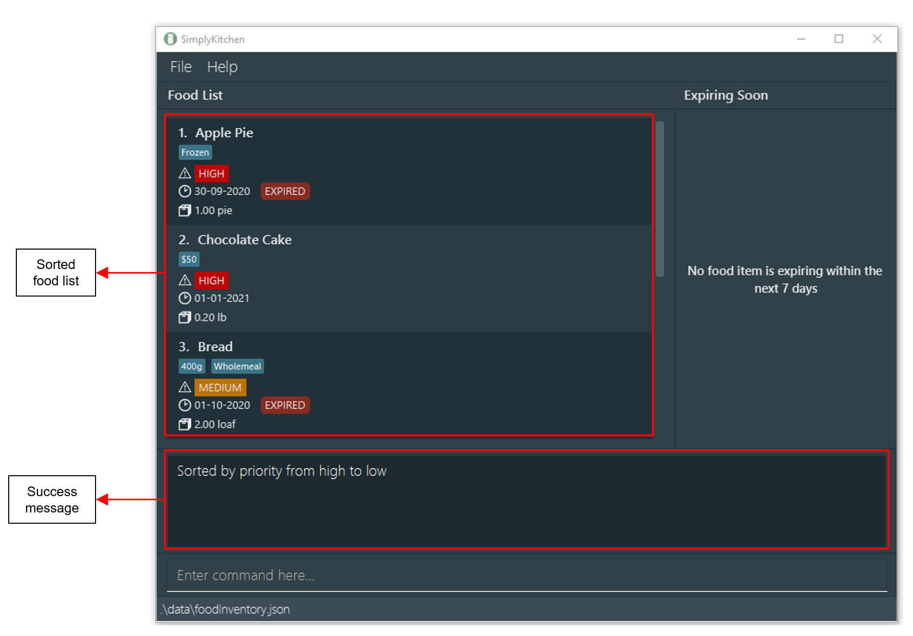

Figure 18: Food items sorted by priority

[Back to top](#table-of-contents)

## 5.3. Viewing commands

The commands in this section are used when navigating food item information on the application.

### 5.3.1. Listing all food items: `list`

The `list` command shows the complete list of food items in your food inventory.
This command is suitable if you want to get a glimpse of all your food items currently in your kitchen.

**Format:** `list`

Steps:
1. Type `list` in the _Command Box_.
2. Press `Enter` to execute.

Before the `list` command is executed:

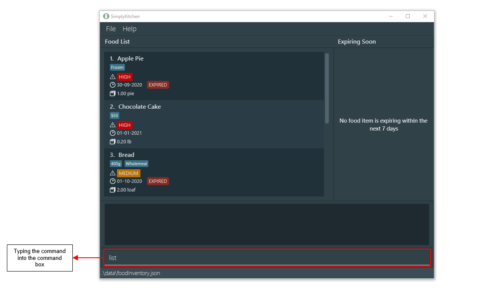

Figure 19: The red box shows the list command being typed into the command box.

After the `sortpriority` command is executed:

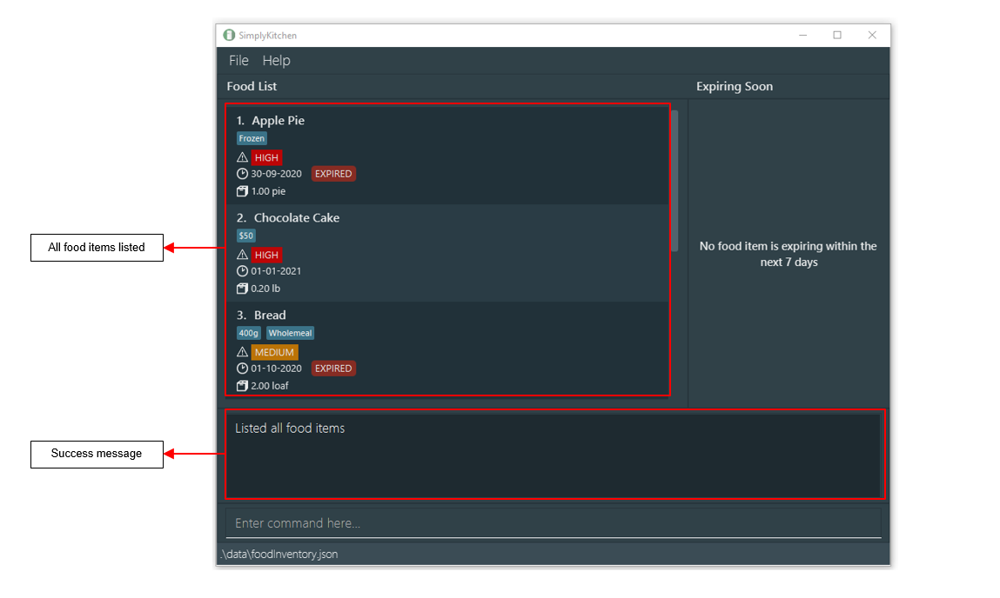

Figure 20: Shows food list with all food items listed.

[Back to top](#table-of-contents)

### 5.3.2. Finding food items: `find`
_(Contributed by Jonah Tan and Boh Cheng Hin)_

The `find` command searches for food items in your food inventory that match the search query and displays the result on your food list. You can easily find a specific food item, or a group of food items.

**Format:** `find [d/DESCRIPTION [MORE_DESCRIPTIONS]...] [e/EXPIRY DATE] [p/PRIORITY] [t/TAG]...`

* The search is case-insensitive (e.g `fish` will match `Fish`).
* Only full words in description will be matched (e.g. `fis` will not match `fish`).
* Food items with description matching at least one keyword (i.e `OR` search) will be returned (e.g. `fish` will return `Fish Cake`, `Tuna Fish`).
* Only full tags will be matched e.g. `nuts` will not match `contains nuts`.
* Food items with tags matching at least one of the search tags (i.e `OR` search) will be returned (e.g. `frozen` will return all food items with tags `frozen` regardless of their other tags).

**:information_source: Note about the parameters:** 

The constraints for the individual parameters of this command (each description in the descriptions parameter, expiry date, quantity, priority and tags) are the same as those for the [`add`](#511-adding-a-food-item-add) command.

**Examples:**
* `find d/apple tuna` can return `Apple Pie` and `Tuna Can`.
* `find e/30-12-2020` returns all food items with expiry date on `30-12-2020`.
* `find d/apple p/high` can return `Apple Pie` and `Apple Jam` if both items have a `HIGH` priority.

* `find t/cat t/dog` returns all food items with the tag `cat` or `dog`.
* `find d/biscuits p/medium e/30-12-2020 t/cat t/dog` returns food items with `biscuits` in their descriptions, `MEDIUM` priorities, expiry dates of `30-12-2020` and have either `cat` or `dog` as tags.

Steps:
1. Type `find e/1-11-2021` in the _Command Box_.
2. Press `Enter` to execute.

Before the `find` command is executed:

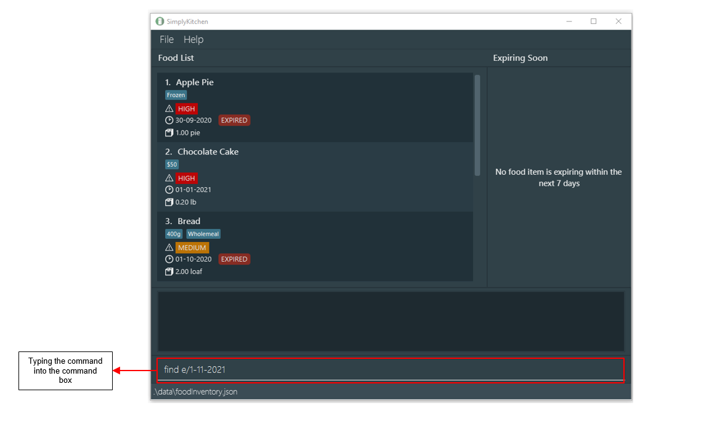

Figure 21: The red box shows the find command being typed into the command box.

After the `find` command is executed:

Figure 22: Shows the food list displaying the result of the find command

[Back to top](#table-of-contents)

### 5.3.3. Viewing expired food items: `expired`

_(Contributed by Ang Song Yi and Jonah Tan)_

When you launch the application, it checks for any expired food items present in your food inventory. This lets you easily see what food items have expired.
If there are any expired food items, a pop-up window similar to the one shown in Figure 23 will appear with the list of expired food item(s).
If you want to see the pop-up window while using the application, you can use the `expired` command.

**Format:** `expired`

Steps:
1. Type `expired` in the _Command Box_.
2. Press `Enter` to execute.

Before the `expired` command is executed:

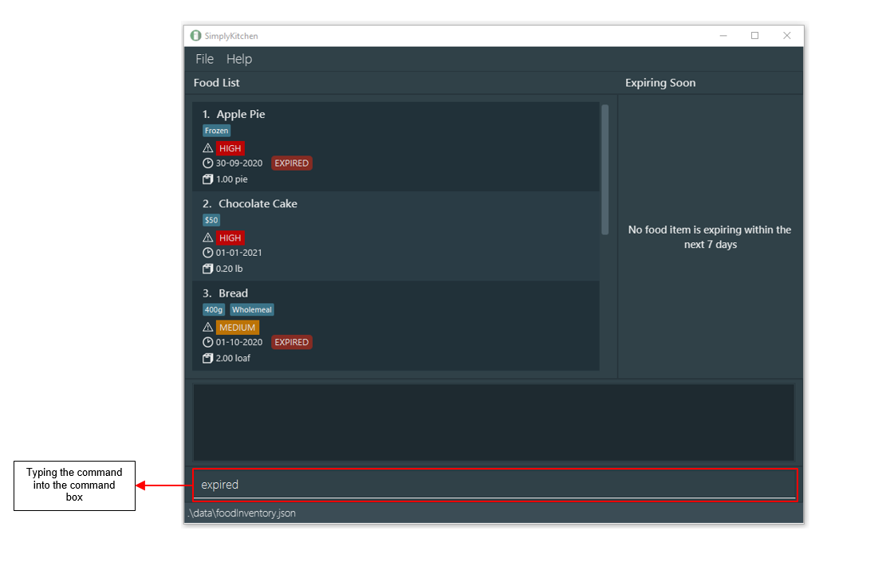

Figure 23: The red box shows the expired command being typed into the command box.

After the `expired` command is executed:

Figure 24: A pop-up window listing all the expired food items

**:information_source: Updating your food inventory:** 

If you have discarded the expired food item, please remember to delete the associated food item from the application using the [`delete`](#513-deleting-a-food-item-delete) command.

[Back to top](#table-of-contents)

## 5.4. Miscellaneous commands

These are additional commands you can use to enhance your experience with SimplyKitchen.

### 5.4.1. Undoing previous command: `undo`
_(Contributed by Boh Cheng Hin)_

The `undo` command restores your food inventory to a state before an undoable command was executed. This lets you easily correct mistakes made on your food inventory.
Undoable commands are commands that modify your food inventory's content ([`add`](#511-adding-a-food-item-add), [`edit`](#512-editing-a-food-item-edit), [`delete`](#513-deleting-a-food-item-delete) , [`changeqty`](#514-changing-the-quantity-of-a-food-item-changeqty) and [`clear`](#543-clearing-all-entries-clear)) and commands that sort food items ([`sortdesc`](#521-sorting-food-items-by-description-sortdesc), [`sortexpiry`](#522-sorting-food-items-by-expiry-date-sortexpiry), [`sortpriority`](#523-sorting-food-items-by-priority-sortpriority)).

**Format:** `undo`

**:exclamation: Warning:** 

Note that the undo/redo history will be cleared when you exit the application!

**Examples:**
* `delete 1` followed by `undo` will reverse the `delete` command.
* `delete 1` followed by `clear` then `undo` will reverse the `clear` command.

Steps:
1. Type `undo` in the _Command Box_.
2. Press `Enter` to execute.

Before the `undo` command is executed:

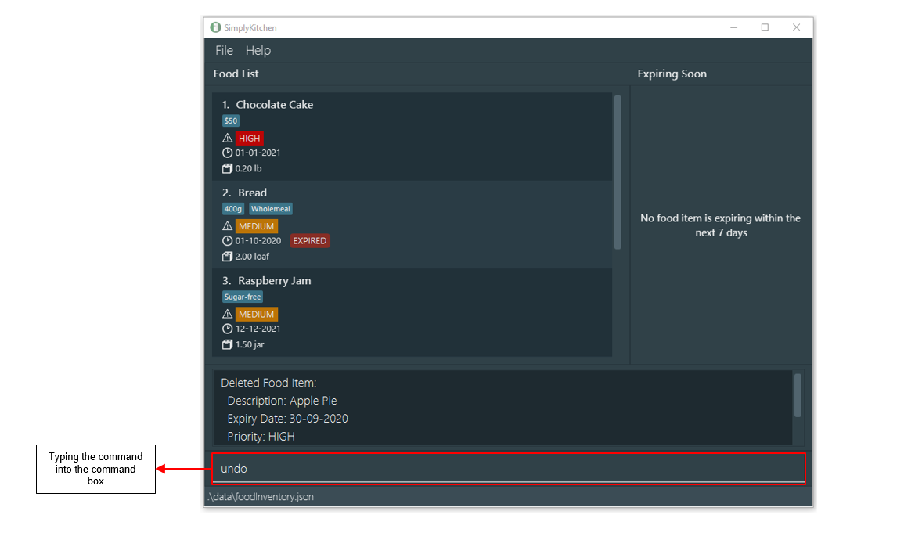

Figure 25: The red box shows the undo command being typed into the command box.

After the `undo` command is executed:

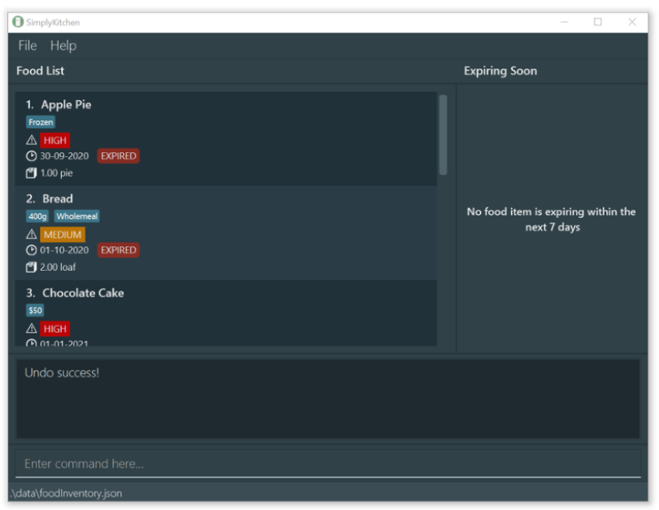

Figure 26: The result box will display "Undo success!" if undo was successful.

[Back to top](#table-of-contents)

### 5.4.2. Redoing previously undone command: `redo`
_(Contributed by Boh Cheng Hin)_

The `redo` command restores your food inventory to a state before an [`undo`](#541-undoing-previous-command-undo) command was executed. This lets you easily redo commands that were incorrectly undone.

**Format:** `redo`

**:exclamation: Warning:** 

Note that the undo/redo history will be cleared when you exit the application!

**Examples:**
* `add d/Donut p/medium e/21-2-2021` followed by `undo` then `redo` will reverse the state to when the food item was added.
* `clear` followed by `undo` then `redo` will redo the `clear` command.

Steps:
1. Type `redo` in the _Command Box_.
2. Press `Enter` to execute.

Before the `redo` command is executed:

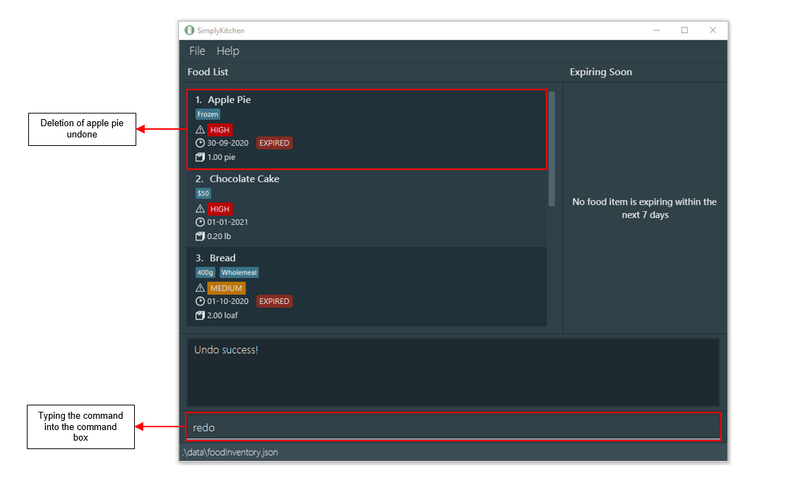

Figure 27: The red box shows the redo command being typed into the command box.

After the `redo` command is executed:

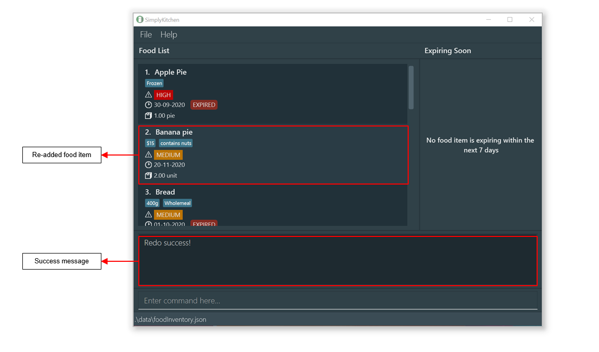

Figure 28: The result box will display "Redo success!" if redo was successful

[Back to top](#table-of-contents)

### 5.4.3. Clearing all entries: `clear`

_(Contributed by Ang Song Yi)_

The `clear` command clears all entries from your food inventory. This lets you easily clear the sample data, or start on a clean food inventory.

**Format:** `clear`

Steps:
1. Type `clear` in the _Command Box_.
2. Press `Enter` to execute.

Before the `clear` command is executed:

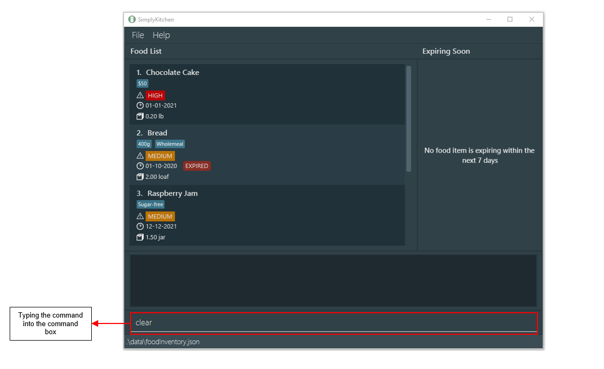

Figure 29: The red box shows the clear command being typed into the command box.

After the `clear` command is executed:

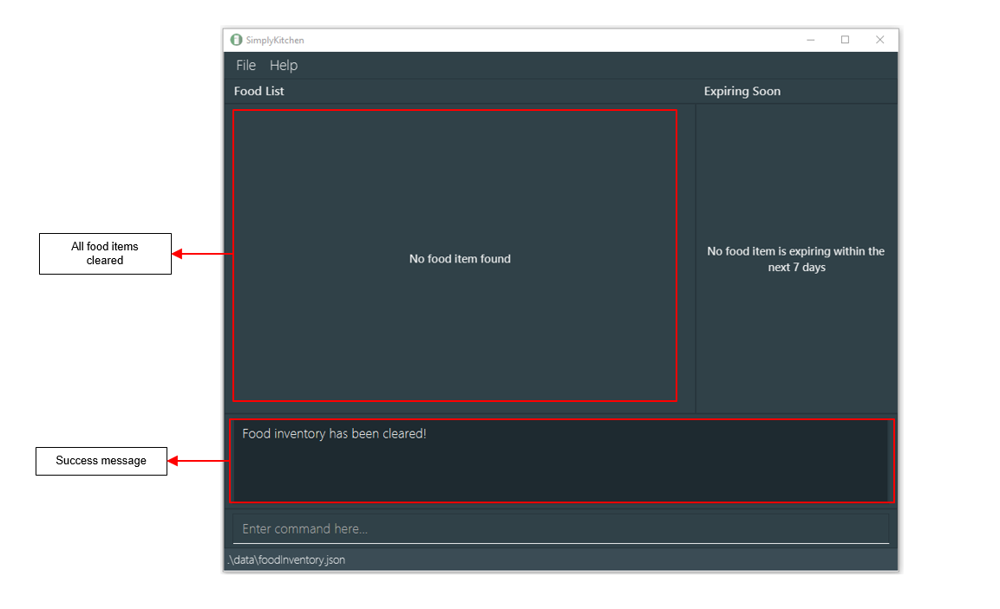

Figure 30: The food list is cleared.

**:exclamation: Warning:** 

Note that the data saved in your hard disk will be cleared when you use this command!

[Back to top](#table-of-contents)

### 5.4.4. Viewing help: `help`

_(Contributed by Ang Song Yi and Boh Cheng Hin)_

The `help` command shows a help message explaining how to access the user guide.
After entering this command, you should see a pop-up window similar to the one shown in Figure 14.

**Format:** `help`

Steps:
1. Type `help` in the _Command Box_.
2. Press `Enter` to execute.

Before the `help` command is executed:

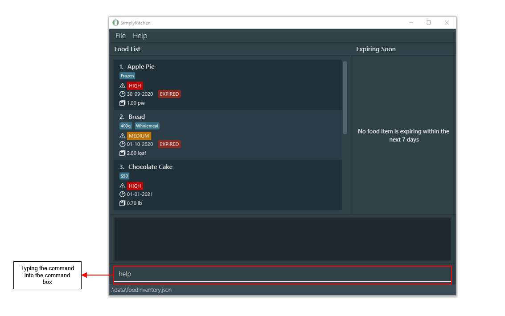

Figure 31: The red box shows the help command being typed into the command box.

After the `help` command is executed:

Figure 32: A pop-up window displaying the URL to the User Guide.

[Back to top](#table-of-contents)

### 5.4.5. Exiting the program: `exit`
_(Contributed by all members)_

The `exit` command closes the application. This lets you easily exit the application from the CLI.

**Format:** `exit`

Steps:
1. Type `exit` in the _Command Box_.
2. Press `Enter` to execute.

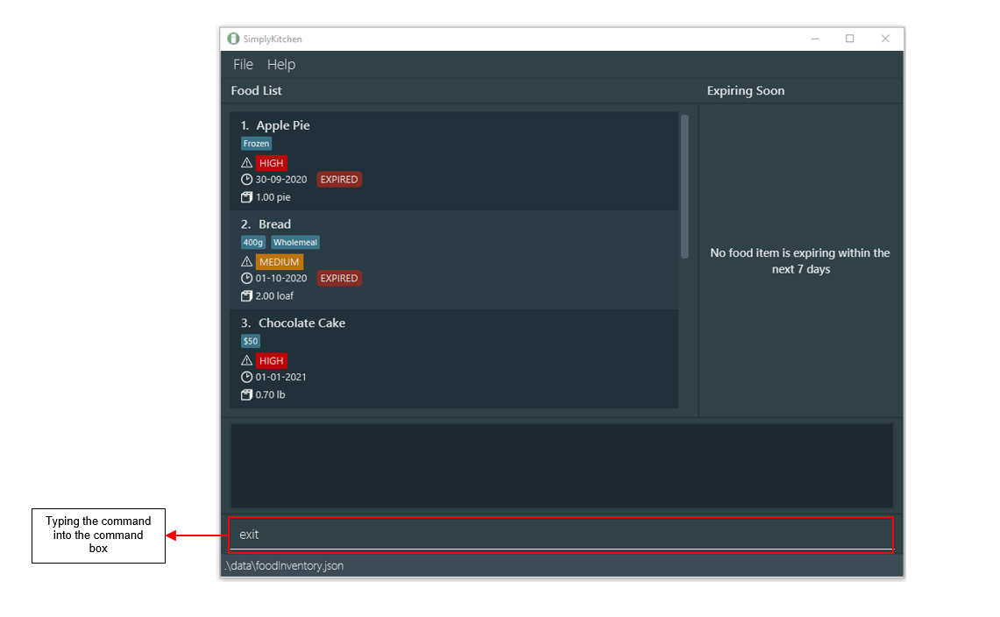

Figure 33: The red box shows the exit command being typed into the command box.

[Back to top](#table-of-contents)

## 5.5. Saving the data
_(Contributed by all members)_

Your food inventory data is saved in the hard disk automatically after any command that changes the data. There is no need to save manually.

[Back to top](#table-of-contents)

--------------------------------------------------------------------------------------------------------------------

# 6. Frequently asked questions (FAQs)
_(Contributed by all members)_

**Q**: How do I transfer my data to another computer? 
**A**: Install the application in the other computer and overwrite the empty data file it creates with the data file in your previous SimplyKitchen home folder.

**Q**: What are the design and implementation considerations behind SimplyKitchen's code? 
**A**: You may find this information at our [Developer Guide](https://ay2021s1-cs2103t-f13-4.github.io/tp/DeveloperGuide.html).

**Q**: How do I report a bug? 
**A**: You may do so by creating a new issue in our [GitHub Repository](https://github.com/AY2021S1-CS2103T-F13-4/tp/issues).

**Q**: What does SimplyKitchen consider as a duplicate food item? 
**A**: In SimplyKitchen, two food items are duplicates if they have the same `description`, `expiry date` and `tags`. 
* All the `tags` must be the same.
* The capitalisation of the characters in the `description` or `tag` is ignored while checking for duplicates.
* The `priority` and `quantity` of food items are not considered while checking for duplicates. 

Figure 15 shows what the application will look like if you try to add a duplicate food item.
In this case, the `description`, `expiry date` and `tag` of the food item to be added is the same as the food item already inside the food inventory.
Therefore, the food item to be added is considered a duplicate.

Figure 15: The result box displays an error message when adding a duplicate food item.

[Back to top](#table-of-contents)

--------------------------------------------------------------------------------------------------------------------

# 7. Command summary
_(Contributed by all members)_

Action | Format, Examples
-------|------------------
**Add** | `add d/DESCRIPTION e/EXPIRY_DATE q/QUANTITY [p/PRIORITY] [t/TAG]...`  e.g. `add d/cereal e/31-10-2020 q/2 p/medium t/corn flakes`
**Edit** | `edit INDEX [d/DESCRIPTION] [e/EXPIRY_DATE] [q/QUANTITY] [p/PRIORITY] [t/TAG]...`  e.g. `edit 1 d/baked beans e/1-1-2020 q/1.5 can`
**Delete** | `delete INDEX` e.g. `delete 3`
**Change quantity** | `changeqty INDEX a/AMOUNT` e.g. `changeqty 1 a/+1.50`
**Sort by description** | `sortdesc`
**Sort by expiry date** | `sortexpiry`
**Sort by priority** | `sortpriority`
**List** | `list`
**Find** | `find [d/DESCRIPTION [MORE_DESCRIPTIONS]...] [e/EXPIRY DATE] [p/PRIORITY] [t/TAG]...`  e.g. `find d/biscuits e/30-12-2020 p/medium t/cat t/dog`
**View expired food items**      | `expired`
**Undo** | `undo`
**Redo** | `redo`
**Clear** | `clear`
**Help** | `help`
**Exit** | `exit`

[Back to top](#table-of-contents)

--------------------------------------------------------------------------------------------------------------------

# 8. Glossary
_(Contributed by all members)_

Term | Definition/Description
-----|------------------
**Case insensitive** | Treating or interpreting uppercase and lowercase letters as being the same.
**CLI** | Command Line Interface. It is a form of user and computer interaction where the user inputs commands in the form of text. Users will utilise a CLI to input commands into SimplyKitchen.
**Command prompt** | A CLI system for Windows which allows users to control their Operating System by entering commands.
**Duplicate food item** | A food item is considered a duplicate if its description, expiry date and tags are all the same as another food item in the food inventory.
**Expiring food item** | A food item is "expiring" if its expiry date is from today, to 7 days after today. For instance, if today is 7-11-2020, food items that expire from 7-11-2020 to 14-11-2020 are deemed as "expiring".
**Food inventory** | A complete list of food items stored in Simply Kitchen.
**GUI** | Graphical User Interface. It is a form of user and computer interaction that allows the user to interact via graphical icons such as buttons, scroll bars and windows. SimplyKitchen has a GUI for the user to interact with.
**Lexicographical order** | The ordering used in dictionaries. 
**Mainstream OS** | Windows, Linux, Unix, OS-X.
**Terminal** | A CLI system for Mac OS which allows users to control their Operating System by entering commands.

[Back to top](#table-of-contents)

--------------------------------------------------------------------------------------------------------------------
