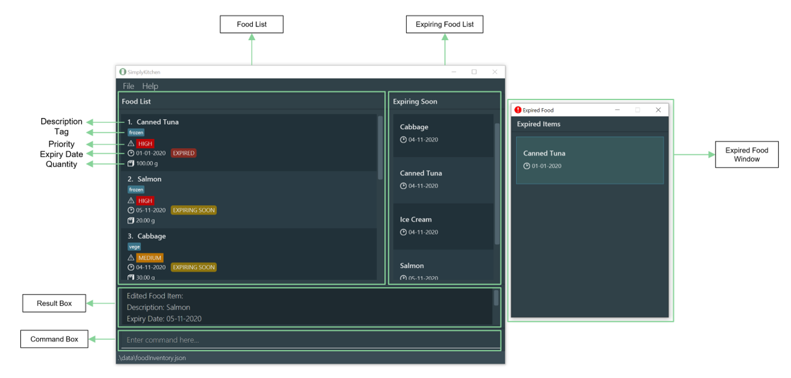

# Sagar Sureka - Project Portfolio

## Project: SimplyKitchen

## Overview

SimplyKitchen is a desktop application for food inventory management.
More importantly, SimplyKitchen is optimised for users who prefer working with a Command Line Interface (CLI), while still having the benefits of a Graphical User Interface (GUI).
With intuitive and user-friendly features, SimplyKitchen facilitates food management tasks which can be done faster and more efficiently than traditional GUI applications.
The GUI for SimplyKitchen has been created with JavaFX. It is written in Java, and has about 10K LoC.

This project is based on the AddressBook-Level3 project created by the [SE-EDU initiative](https://se-education.org/).

## Summary of contributions

* **Code contributed**: [Link to RepoSense](https://nus-cs2103-ay2021s1.github.io/tp-dashboard/#breakdown=true&search=Sagar&sort=groupTitle&sortWithin=title&since=2020-08-14&timeframe=commit&mergegroup=&groupSelect=groupByRepos&checkedFileTypes=docs~functional-code~test-code~other&tabOpen=true&tabType=authorship&tabAuthor=sagarsureka&tabRepo=AY2021S1-CS2103T-F13-4%2Ftp%5Bmaster%5D&authorshipIsMergeGroup=false&authorshipFileTypes=docs~functional-code~test-code)

* **Enhancements**:
  * Added a **quantity field** for food items:
    * What it does:  Allows the user to track the quantity of each food item.
    * Justification:  The features improves the application significantly as it helps manage another entity relevant to food items.
    * Highlights:  This enhancement involved consideration of multiple alternatives of implementation. 
    Keeping to the criteria of making it user friendly, the `unit` of quantity field was made optional and customisable. 
    Instead of giving some specific options, the user can have any word as the unit.
  * Adding a list for **expiring food items**:
    * What it does:  Displays a list panel consisting of food items expiring within 7 days, in ascending order of expiry date.
    * Justification:  Keeping with the motivation of reducing food wastage by food inventory management, the expiring food list allows the user to make informed choices in their meals and avoid having to waste expired food.
    * Highlights:  This enhancement required the introduction of another list into the GUI of the app.
    In order to keep the GUI clean and not make it too clustered, the expiring food list panel was kept smaller and the food cards in the list had only the minimum details required to properly differentiate the items from each other.

* **Minor Enhancements**:
  * Contributed in adapting the AB3 code to SimplyKitchen by removing the address field which was no longer needed. [\#70](https://github.com/AY2021S1-CS2103T-F13-4/tp/pull/70)
  * Improved the responses given to the user by making it more readable and informative. [\#79](https://github.com/AY2021S1-CS2103T-F13-4/tp/pull/79)  
  * Improved the product User Guide by fixing bugs reported in the Mock Practical Exam. [\#174](https://github.com/AY2021S1-CS2103T-F13-4/tp/pull/174)  

* **Project Management and contribution to team-based tasks**:
  * Participated in the planning of the project idea (Management of food inventory to reduce food wastage).
  * Participated in drafting the initial requirements for SimplyKitchen - *Product Scope, Glossary, User Stories, Use Cases and Non-Functional Requirements.* 
    This can be found in our [Developer Guide requirements appendix](https://ay2021s1-cs2103t-f13-4.github.io/tp/DeveloperGuide.html#appendix-requirements).
  * Compiled the comments received on the team's User and Developer Guides from peers.
  * Responsible for proper integration of the various parts of the software to form a whole.
  * Responsible for ensuring that the project code maintains high coding standards.
  
* **Documentation**:
  * User Guide:
    * Made updates to all the features affected by the implementation of the `quantity` field. [\#90](https://github.com/AY2021S1-CS2103T-F13-4/tp/pull/90)
    * Added the `Introduction`, `About this document` and `Quick start` sections. Also improved navigability of the guide by linking the headings and subheadings to the table of contents and vice versa. [\#123](https://github.com/AY2021S1-CS2103T-F13-4/tp/pull/123)     
    * Added to the sections of `Notes about the command format` and the `FAQs`. [\#174](https://github.com/AY2021S1-CS2103T-F13-4/tp/pull/174)                 
  * Developer Guide:
    * Added the design details of the `quantity` field along with the alternatives considered while implementing the feature. [\#90](https://github.com/AY2021S1-CS2103T-F13-4/tp/pull/90)
    * Added the `Introduction` and `About this document` sections. [\#123](https://github.com/AY2021S1-CS2103T-F13-4/tp/pull/123)

* **Community**:
  * Pull Requests reviewed (with non-trivial review comments): [\#54](https://github.com/AY2021S1-CS2103T-F13-4/tp/pull/54), [\#118](https://github.com/AY2021S1-CS2103T-F13-4/tp/pull/118)
  * Reported bugs and suggestions for other teams in the module.

* **Tools**:
  * Initial setup of project tools - GitHub Organisation.
  * Participated in the managing of GitHub project board and issue tracker for project management, milestones and bugs.
